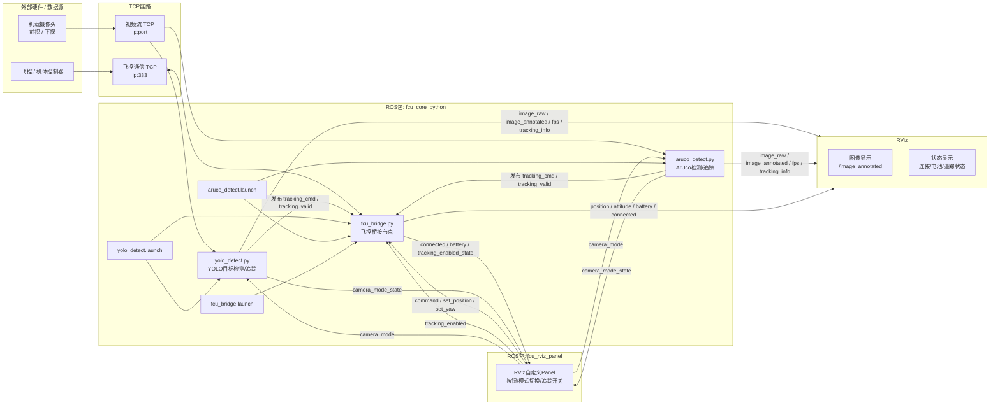

# 系统框架

## 架构图

```mermaid
flowchart LR
  subgraph HW["外部硬件 / 数据源"]
    CAM["机载摄像头\n前视 / 下视"]
    FCU["飞控 / 机体控制器"]
  end

  subgraph NET["TCP链路"]
    VIDEO["视频流 TCP\nip:port"]
    CTRL["飞控通信 TCP\nip:333"]
  end

  subgraph CORE["ROS包: fcu_core_python"]
    YL["yolo_detect.py\nYOLO目标检测/追踪"]
    AR["aruco_detect.py\nArUco检测/追踪"]
    BR["fcu_bridge.py\n飞控桥接节点"]
    YL_LAUNCH["yolo_detect.launch"]
    AR_LAUNCH["aruco_detect.launch"]
    BR_LAUNCH["fcu_bridge.launch"]
  end

  subgraph UI["ROS包: fcu_rviz_panel"]
    PANEL["RViz自定义Panel\n按钮/模式切换/追踪开关"]
  end

  subgraph RV["RViz"]
    IMG["图像显示\n/image_annotated"]
    STATUS["状态显示\n连接/电池/追踪状态"]
  end

  CAM --> VIDEO
  FCU --> CTRL

  VIDEO --> YL
  VIDEO --> AR
  CTRL <--> BR

  YL -->|"发布 tracking_cmd / tracking_valid"| BR
  AR -->|"发布 tracking_cmd / tracking_valid"| BR

  PANEL -->|"command / set_position / set_yaw"| BR
  PANEL -->|"tracking_enabled"| BR
  PANEL -->|"camera_mode"| YL
  PANEL -->|"camera_mode"| AR

  BR -->|"connected / battery / tracking_enabled_state"| PANEL
  YL -->|"camera_mode_state"| PANEL
  AR -->|"camera_mode_state"| PANEL

  YL -->|"image_raw / image_annotated / fps / tracking_info"| RV
  AR -->|"image_raw / image_annotated / fps / tracking_info"| RV
  BR -->|"position / attitude / battery / connected"| RV

  YL_LAUNCH --> YL
  YL_LAUNCH --> BR
  AR_LAUNCH --> AR
  AR_LAUNCH --> BR
  BR_LAUNCH --> BR

```
