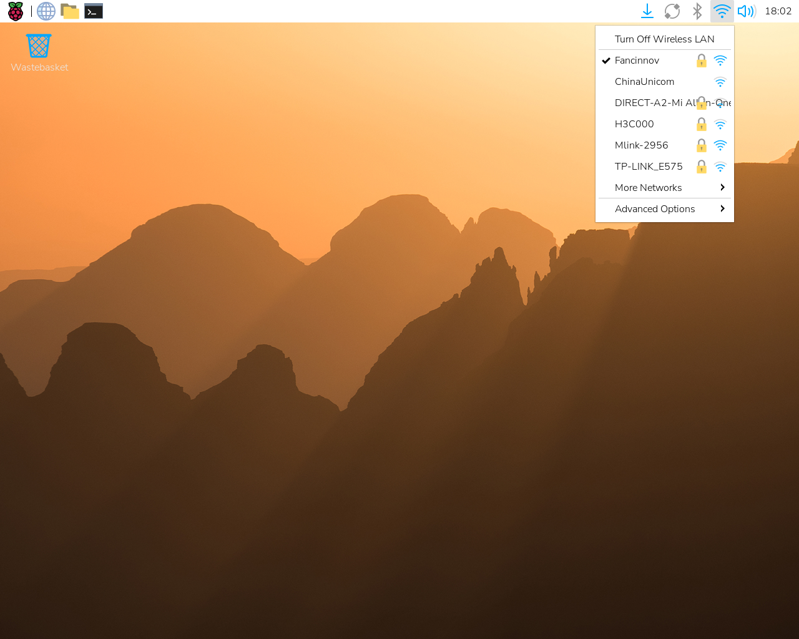
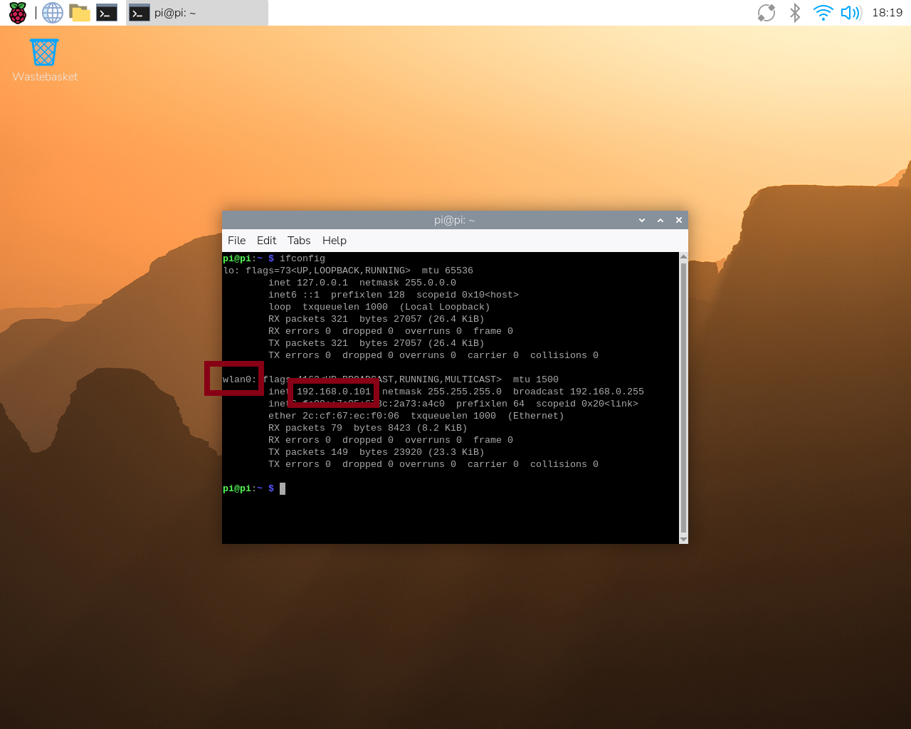
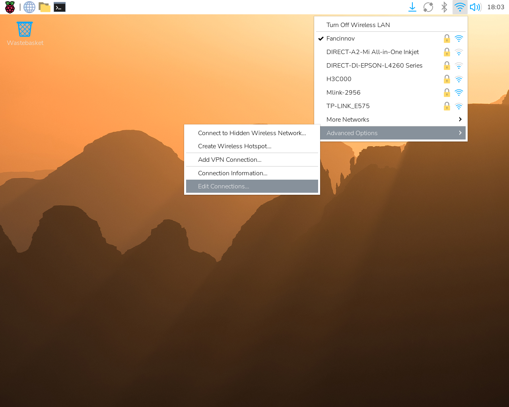
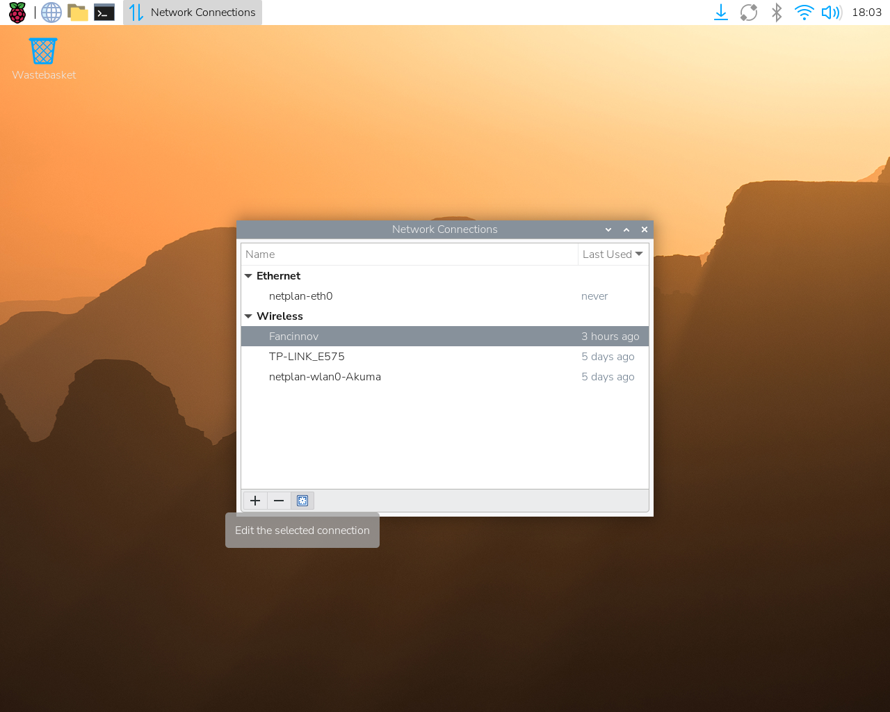
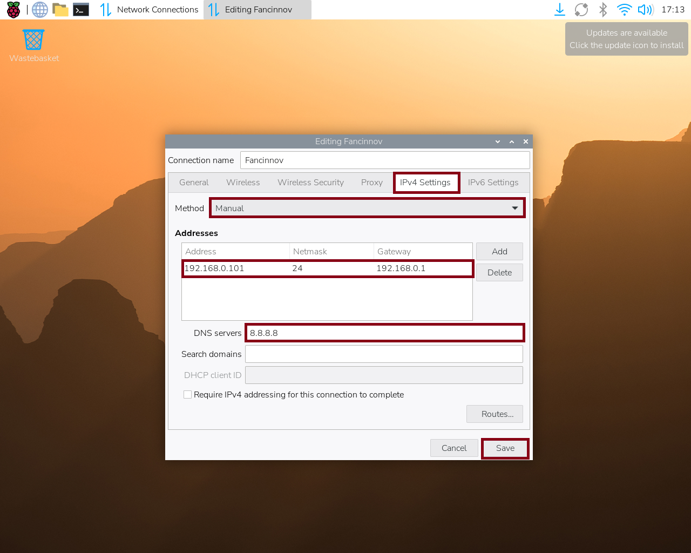
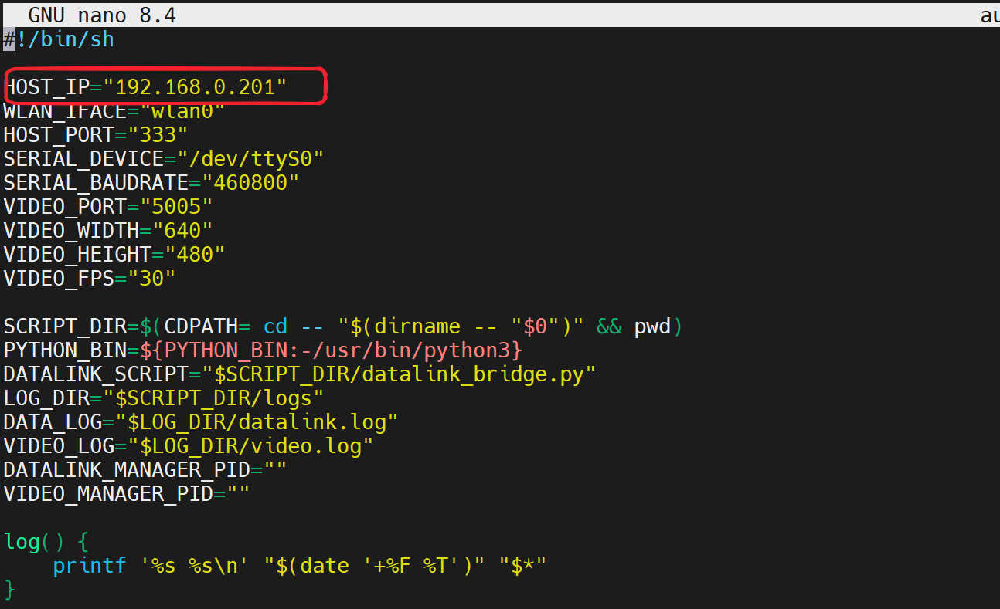
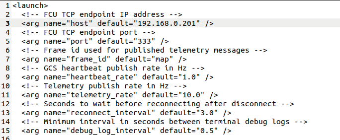

# 环境部署

现在我们开始进行无人机的环境部署

## 树莓派系统烧录

将8G的SD卡放入读卡器

首先下载[树莓派官方烧录镜像工具](https://downloads.raspberrypi.com/imager/imager_latest.exe)

安装之后打开烧录镜像工具

首先进行格式化操作：

1. 设备-->`Raspberry Pi Zero 2w`
2. 操作系统-->`格式化`
3. 储存设备-->`SD卡`
4. 点击写入

下载幻思提供的镜像（链接待补充）

格式化过SD卡之后我们可以进行镜像烧录：

1. 设备-->`Raspberry Pi Zero 2w`
2. 操作系统-->`使用自定义镜像`-->下载我们的自定义镜像（链接待补充）并选择
3. 储存设备-->`SD卡`
4. 点击写入

## 更改树莓派的静态IP

1. 点击右上角网络连接图标，进行网络连接

2. 查看自己ip地址

3. 配置网络相关

4. 设置网络静态IP

:::tip

不同网络的网段不一样，如更换网络，ip地址也需更改。

:::

:::danger

更改ip地址之后autostart.sh中的IP地址也需要更改

:::

## 部署远程电脑环境

远程电脑的环境搭建相对简单很多，先完成下面两个步骤：

- VMware虚拟机的安装
- [ROS安装教程](../../通用教程/ROS/安装ROS.md)

然后使用下面安装命令进行虚拟机的环境安装

~~~shell
sudo chmod +x autodeploy.sh
./autodeploy.sh
~~~

创建ROS工作空间并拉取我们提供的无人机地面站（基于ROS）

~~~
mkdir -p ~/ros_ws_python/src
cd ~/ros_ws_python/src
git clone (（链接待补充）)
~~~

首次编译测试

~~~
cd ~/ros_ws_python
catkin_make
~~~

更改launch文件的ip地址，测试是否连通

~~~shell
cd ~/ros_ws_python
source devel/setup.bash
roslaunch fcu_core_python fcu_bridge.launch
~~~

无人机发出连接报警，远程电脑终端输出心跳包，说明环境搭建完成。
