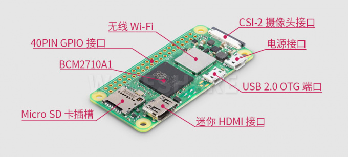
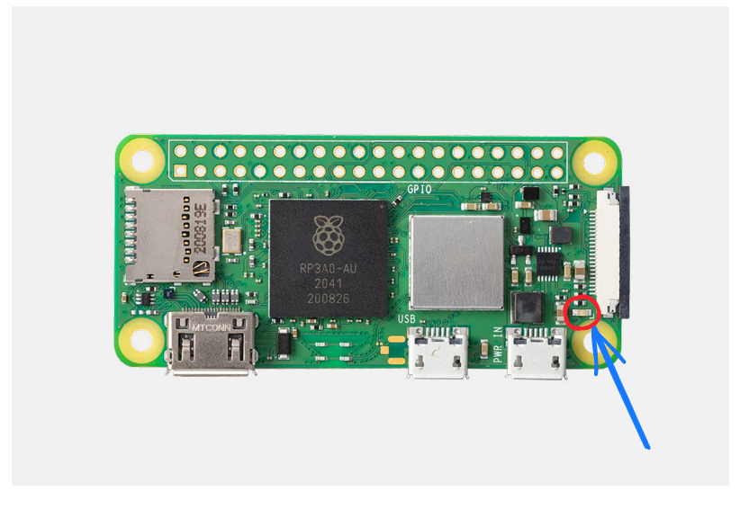

# 用前须知

## 树莓派-zero-2w

在前一代 Zero 系列的基础上，Raspberry Pi Zero 2 W 秉承着 Zero 系列的设计理念，在非常小巧的板子上集成了 BCM2710A1 芯片和 512MB 的 RAM，并巧妙的把所有组件都单面放置，使得小小封装也能有如此高的性能。另外，在散热上也独具匠心，使用厚厚的内部铜层将热量从处理器传导出去，不用担心高性能带来的高温问题。

主要功能特性有：

- Broadcom BCM2710A1，四核 64 位 SoC（Arm Cortex-A53 @ 1GHz）
- 512MB LPDDR2 SDRAM
- 2.4GHz IEEE 802.11b/g/n 无线局域网，蓝牙 4.2、BLE
- 板载 1 个 Mirco USB 2.0 接口，带 OTG
- 板载 Raspberry Pi 40 Pin GPIO 接口焊盘，适用于树莓派系列扩展板
- MicroSD 卡插槽
- Mini HDMI 输出接口
- 复合视频接口焊盘，和复位接口焊盘
- CSI-2 摄像头接口
- H.264, MPEG-4 编码 (1080p30); H.264 解码 (1080p30)
- 支持 OpenGL ES 1.1、2.0 图形

:::note

树莓派的系统指示灯如下图所示，如果系统正常启动，系统知识灯为绿灯，否则为红灯。

:::

## Mcontroller-v7 控制器

Mcontroller® 是一款先进的飞控系统，由北航技术团队历时五年研发，拥有多项发明专利，被广泛应用于无人机、无人车、无人船等机器人领域。其强大的性能和独创的跨模态系统架构使其成为业界新秀。 Mcontroller® 具备卓越的稳定性、可扩展性和灵活性，为用户提供高效、便捷的移动机器人控制解决方案，助力教育科研和机器人产品研发。

板载资源有:

物理接口有:

## 静态调试

使用我们配备的USB烧录线，一头连接飞控Micro-USB口，另一头连接电脑USB口，树莓派zero2w的micro-hdmi接口连接显示器，usb连接拓展坞连接键盘鼠标。

:::tip

静态调试状态下与无人机电池无关，可以一边给电池充电一边静态调试，节省时间。

:::