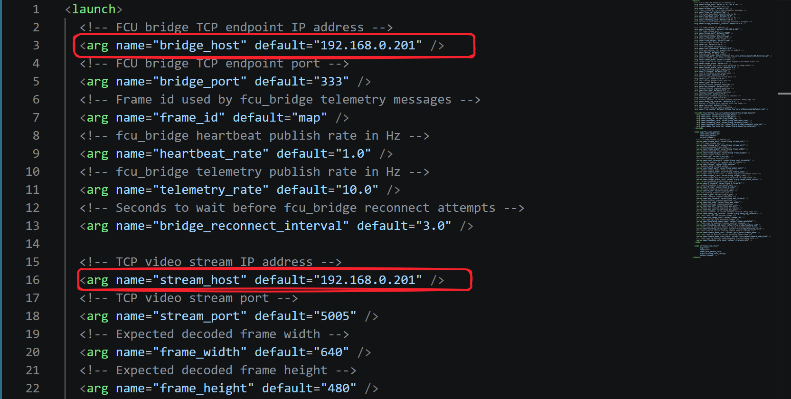
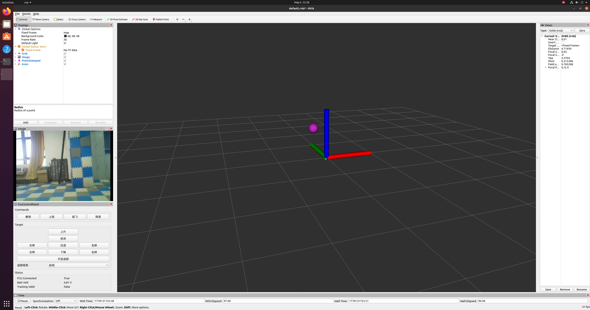
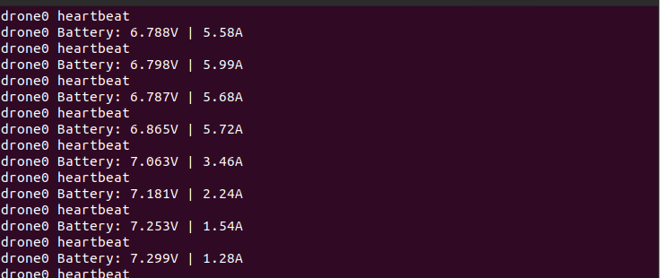

# 识别追踪

## yolo的识别追踪

### 操作界面说明

更改yolo_detect.launch文件中的IP地址为飞机实际IP地址

运行yolo检测程序

~~~
roslaunch fcu_core_python yolo_detect.py
~~~

根据上图所示，左下角为操作界面，操作界面上面有实时检测画面的显示。

### 飞行

开始运行识别追踪程序

- 将无人机置于飞行场地起飞点，上电，在初始化之后拿起离地1m以上再放下，完成初始化。

- 确保远程电脑与树莓派2w处在同一局域网下面，可以通过`ping`命令测试

- 网络连接没问题的情况下，运行追踪程序

~~~shell
roslaunch fcu_core_python yolo_detect.py
~~~

- 检查终端是否输出心跳包和电压电流值，正常结果如下所示

- 接下来聚焦到rviz界面，下面就可以通过各式各样的button去控制无人机飞行了

`解锁`->`起飞`->`选择前视/下视`->`开始追踪`->`关闭追踪`->`降落`->`上锁`

其他button不做过多介绍。

## aruco的识别追踪

操作界面和yolo识别追踪一模一样，这里不做赘述。

### 飞行

开始运行识别追踪程序

- 将无人机置于飞行场地起飞点，上电，在初始化之后拿起离地1m以上再放下，完成初始化。

- 确保远程电脑与树莓派2w处在同一局域网下面，可以通过`ping`命令测试

- 网络连接没问题的情况下，运行追踪程序

~~~
roslaunch fcu_core_python aruco_detect.py
~~~

- 检查终端是否输出心跳包和电压电流值，正常结果如下所示

- 接下来聚焦到rviz界面，下面就可以通过各式各样的button去控制无人机飞行了

`解锁`->`起飞`->`选择前视/下视`->`开始追踪`->`关闭追踪`->`降落`->`上锁`

其他button不做过多介绍。