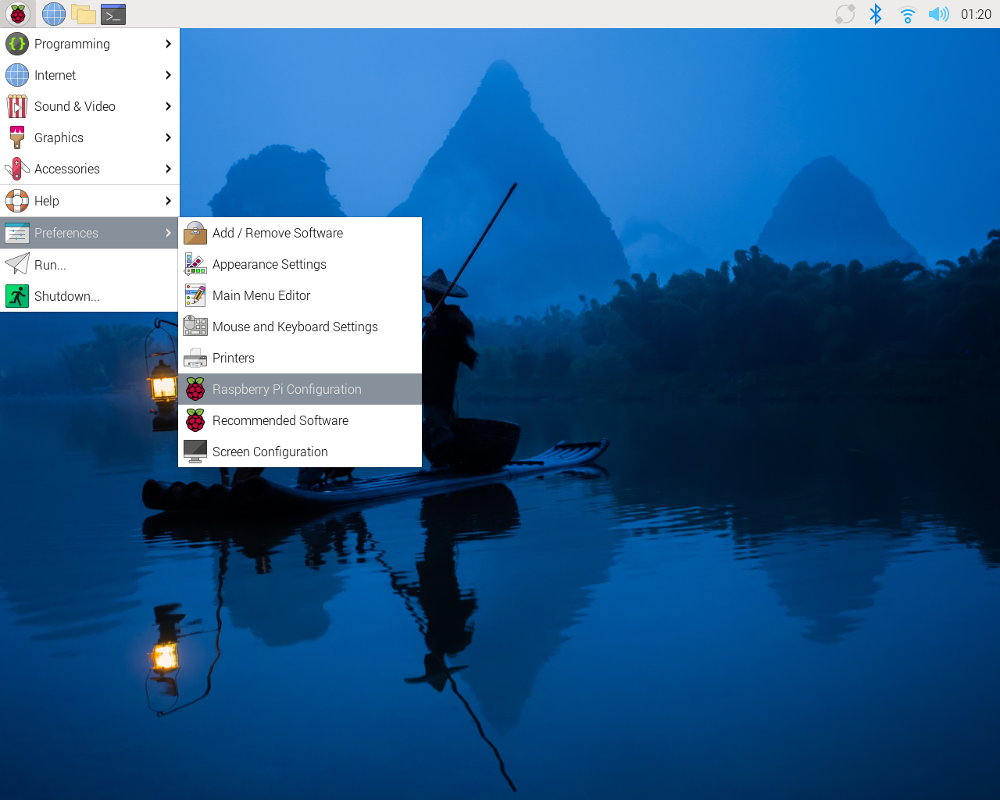
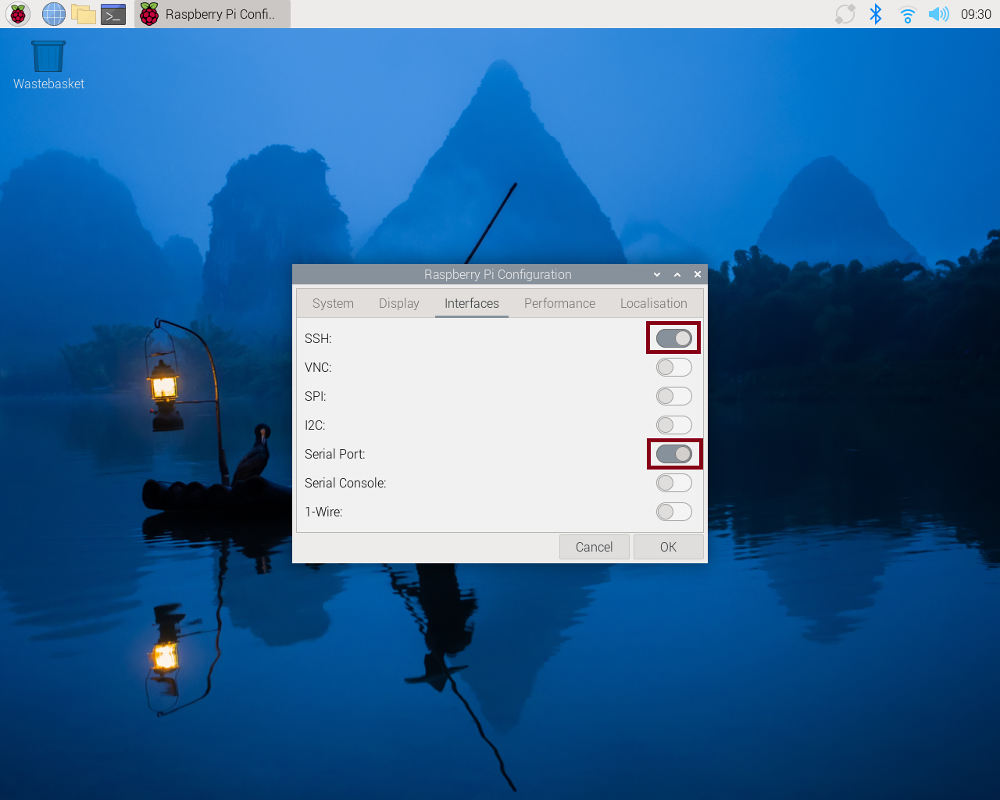
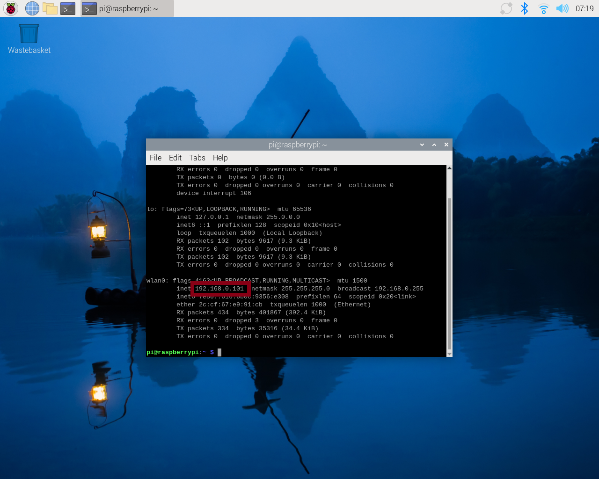
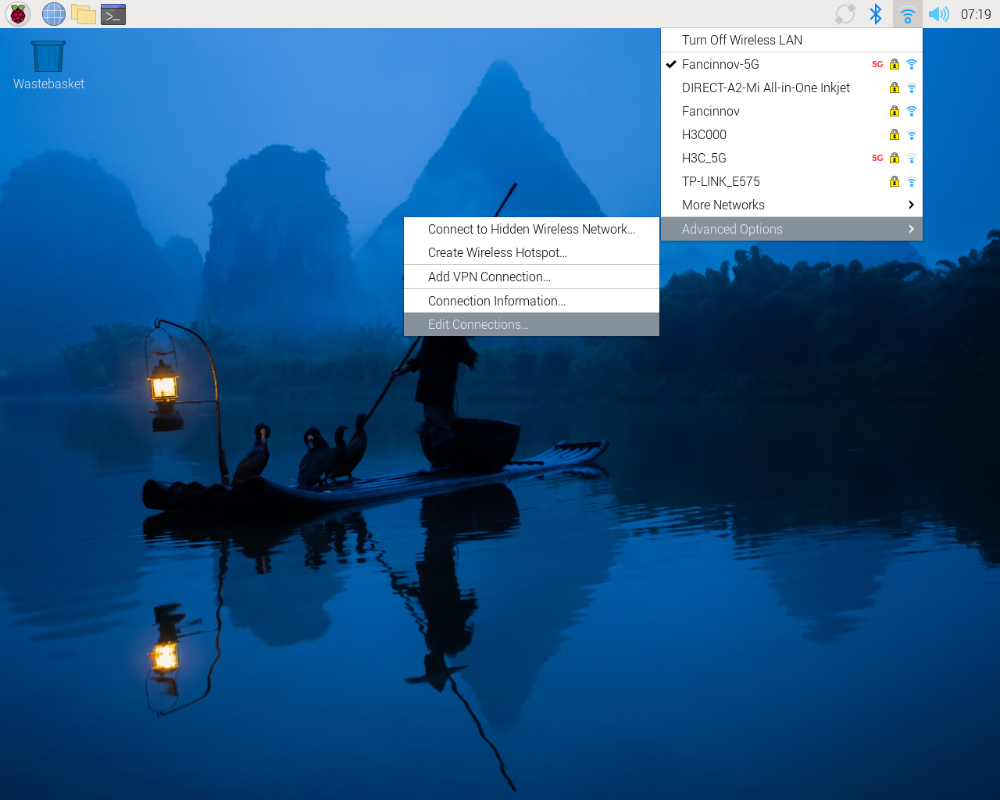
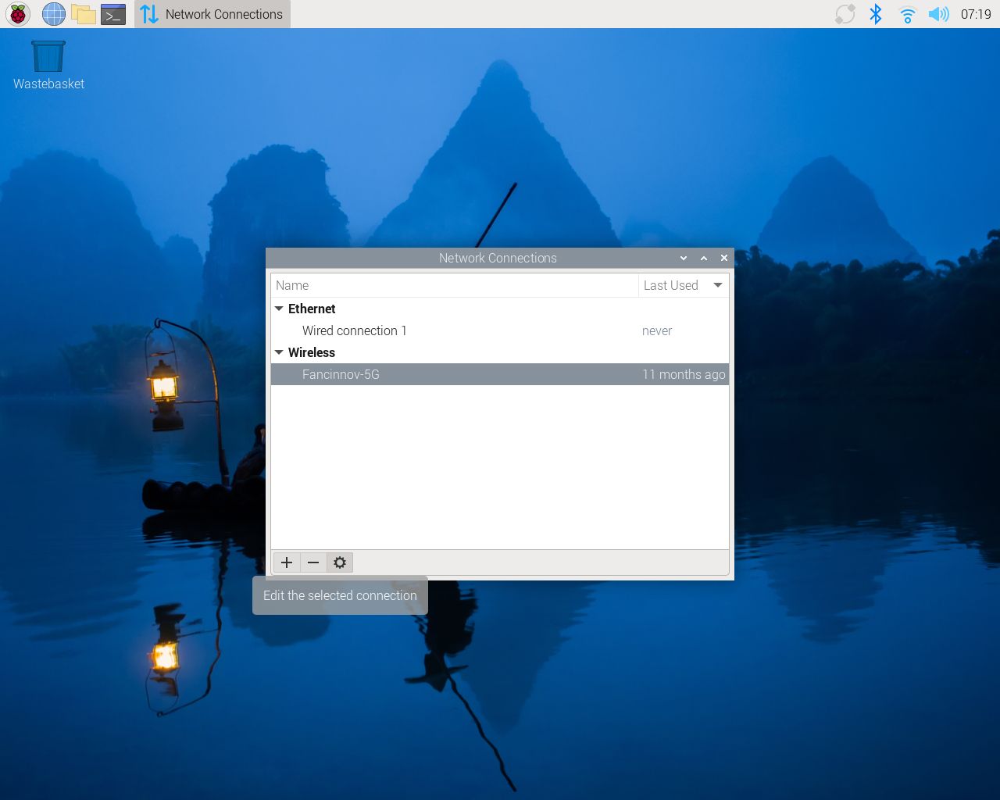
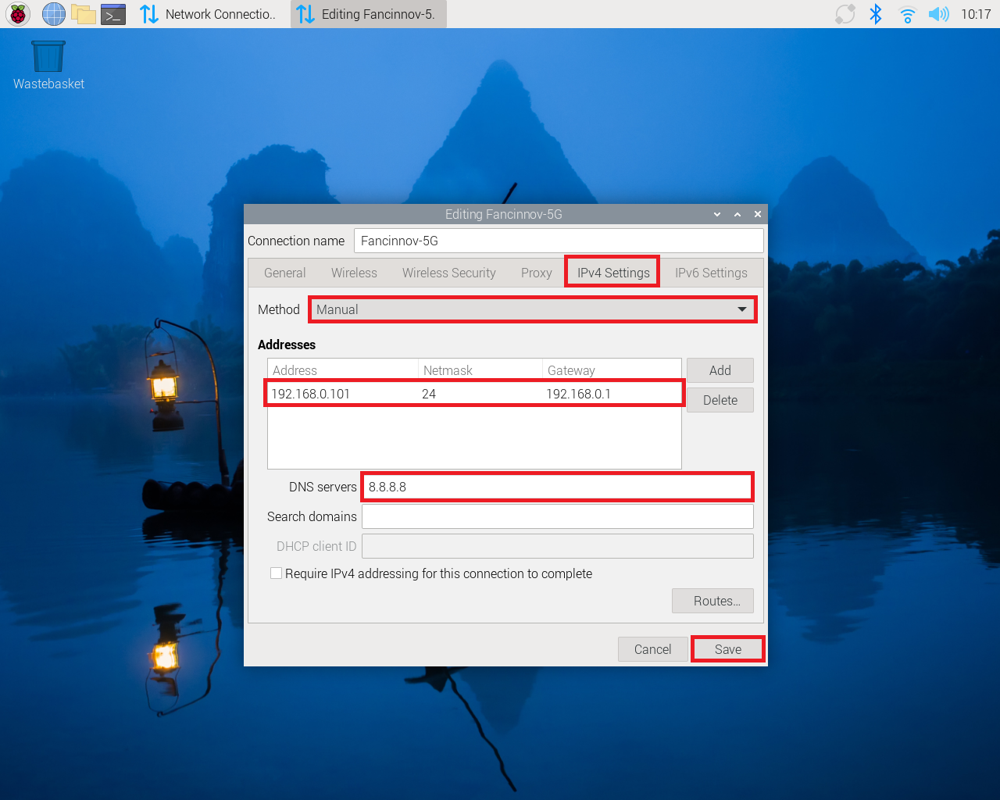

# 环境部署

现在我们开始进行无人机的环境部署

## 树莓派系统烧录

将64G的SD卡放入读卡器

首先下载[树莓派官方烧录镜像工具](https://downloads.raspberrypi.com/imager/imager_latest.exe)

安装之后打开烧录镜像工具

首先进行格式化操作：

1. 设备-->`Raspberry Pi 5`
2. 操作系统-->`格式化`
3. 储存设备-->`SD卡`
4. 点击写入

下载幻思提供的镜像（链接待补充）

格式化过SD卡之后我们可以进行镜像烧录：

1. 设备-->`Raspberry Pi 5`
2. 操作系统-->`使用自定义镜像`-->下载我们的自定义镜像（链接待补充）并选择
3. 储存设备-->`SD卡`
4. 点击写入

进入系统初始化界面之后，一路继续，建议用户名使用`pi`，密码使用`123456`，和我们案例一致，避免忘记密码的情况出现。最后忽略更新软件更新步骤，直接重启。

重启之后开启SSH和串口硬件

:::note

`Serial Console`也需要disable，会影响串口的正常工作。

:::

## 安装必要的python环境

下载树莓派5工程包(（链接待补充）)并解压

将工程包放置树莓派根目录(/home/pi)并执行自启动脚本

~~~shell
cd ./yolo
sudo chmod +x ./autodeploy.sh
./autodeploy.sh
~~~

最后会要求你重启系统，建议直接重启，不然无法使用摄像头。

进行环境测试

~~~shell
cd ~/yolo
source ./.venv/bin/activate
yolo export model=yolo26n.pt format=ncnn # turn pt into ncnn(faster)
python test.py # run test script
~~~

正常的话就能够看到无人机摄像头里的内容了

## 更改树莓派的静态IP(可选)

1. 点击右上角网络连接图标，进行网络连接

2. 查看自己ip地址

3. 配置网络相关

4. 设置网络静态IP

:::tip

不同网络的网段不一样，如更换网络，ip地址也需更改。

:::