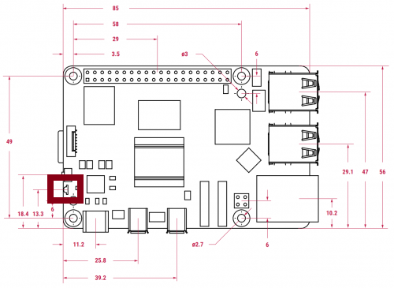
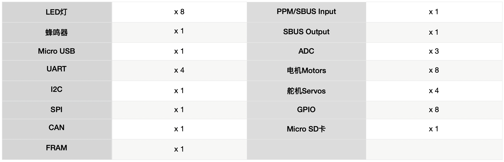
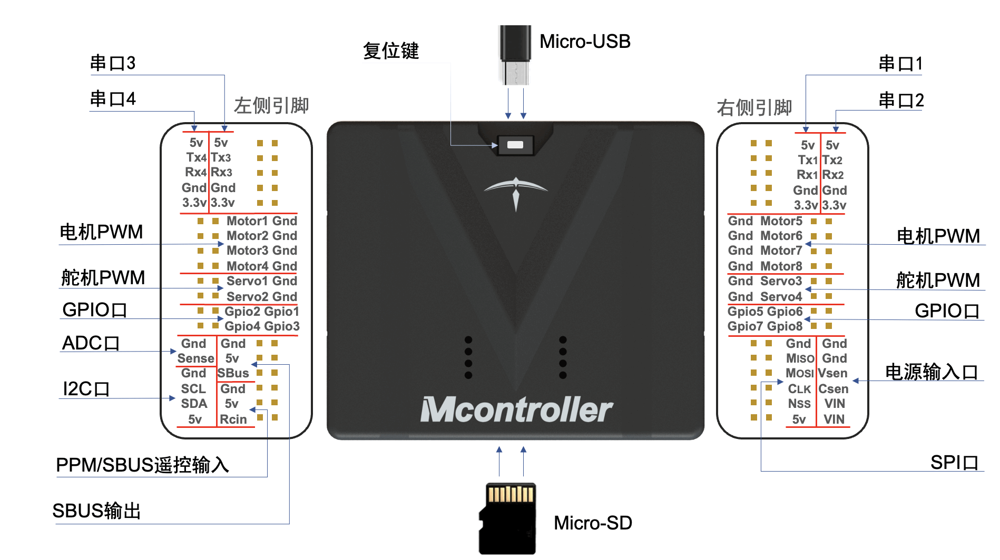

# 用前须知

## 树莓派5

我是树莓派5代，相比树莓派4B，我的处理器速度是上一代产品的 2-3 倍，拥有丰富的多媒体，多个内存版本和更出色的连接性,集成RP1 I/O 控制器,USB3 具有更大的总带宽，新增PCIE接口,传输速度更快。

主要功能特性有：

- Broadcom BCM2712 (Arm Cortex A76)
- 64 位 2.4GHz 四核，512KB 二级缓存和 2MB 共享三级缓存
- 千兆以太网
- 2.4GHz/5GHz 双频 802.11ac Wi-Fi
- 蓝牙 5.0，BLE
- USB 3.0 x 2 (支持 5Gbps 同步运行)、USB 2.0 x 2
- 微型 HDMI x 2（支持 4Kp60）
- 千兆位以太网（支持 PoE）
- MicroSD 插槽
- 40PIN GPIO 接头
- 2 × 4-lane MIPI DSI/CSI 接口
- USB Type C电源（5V/5A）
- 电源按钮
- 实时时钟 (RTC)，由外部电池供电
- PCIe 2.0 x1 接口
- UART调试口

:::note

树莓派的系统指示灯如下图所示，如果系统正常启动，系统知识灯为绿灯，否则为红灯。

:::

## Mcontroller-v7 控制器

Mcontroller® 是一款先进的飞控系统，由北航技术团队历时五年研发，拥有多项发明专利，被广泛应用于无人机、无人车、无人船等机器人领域。其强大的性能和独创的跨模态系统架构使其成为业界新秀。 Mcontroller® 具备卓越的稳定性、可扩展性和灵活性，为用户提供高效、便捷的移动机器人控制解决方案，助力教育科研和机器人产品研发。

板载资源有:

物理接口有:

## 静态调试

**断开供电模块和树莓派5的电源线连接（红线）**，使用我们配备的树莓派官方电源给树莓派5供电，如若需要联合飞控进行调试，还需使用我们配备的micro-usb 转 USB typec-A 线一头插入飞控micro-usb口一头插入电脑，用电脑USB口给飞控进行供电。

:::tip

静态调试状态下与无人机电池无关，可以一边给电池充电一边静态调试，节省时间。

:::