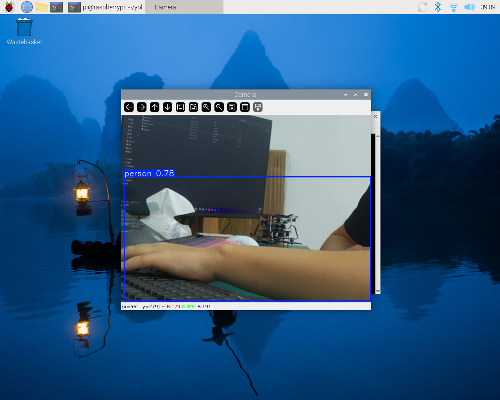

# 识别追踪

## yolo识别

使用autodeploy.sh来部署树莓派5的环境，默认开启detect.py的开机自启动。



## yolo追踪

`detect.py` 实现的是基于检测框位置的视觉跟随控制，不使用 YOLO 的多目标追踪（`model.track()`）。

### 模式开关

| 参数 | 默认值 | 含义 |
| --- | --- | --- |
| `TrackDown` | `False` | `False` 为前视跟随（`forward`）；`True` 为俯视跟随（`down`）。该值需在代码中修改后重启。 |

### 控制与检测参数

| 参数 | 默认值 | 含义 |
| --- | ---: | --- |
| `k_forward` | 1.2 | 前后速度比例系数。 |
| `k_side` | 0.35 | 俯视模式横移速度比例系数。 |
| `k_yaw` | 0.4 | 前视模式偏航角速度比例系数。 |
| `max_forward` | 0.6 | 前后速度绝对值上限。 |
| `max_side` | 0.4 | 横移速度绝对值上限。 |
| `max_yaw` | 0.35 | 偏航角速度绝对值上限。 |
| `target_width_ratio` | 0.4 | 前视模式的期望人框宽度占画面宽度比例；小于该值前进，大于该值后退。 |
| `conf` | 0.5 | YOLO 检测置信度阈值。 |
| `classes` | `[0]` | 仅检测类别 0，通常为 `person`。 |

### 控制规则

#### 前视模式（`TrackDown = False`）

```python
cmd_linear_x = clamp(k_forward * (target_width_ratio - width_ratio), max_forward)
cmd_angular_z = clamp(k_yaw * error_x, max_yaw)
```

- 人框过小则前进，过大则后退。
- 目标偏离画面中心时，通过偏航转向修正。
- 不进行横移控制。

#### 俯视模式（`TrackDown = True`）

```python
cmd_linear_x = clamp(-0.3 * k_forward * error_y, max_forward)
cmd_linear_y = clamp(0.3 * k_side * error_x, max_side)
```

- 根据目标的上下、左右偏差控制前后和横移，使目标回到画面中心。
- 不控制距离、垂直速度或偏航。

:::warning

- 代码仅使用当前检测结果中的第一个目标框，不会稳定绑定某个人；多人出现时，目标可能切换。
- 未检测到目标时不会发送新的 `set_pose()` 指令，上一条指令是否持续取决于 `datalink` 的实现。

:::

---

接下来我们可以使用实现无人机进行对人的识别追踪

- 将无人机置于飞行场地起飞点，上电，在初始化之后拿起离地1m以上再放下，完成初始化，静止等待树莓派启动，待到无人机飞控与树莓派连接成功即可

- 插上遥控器接收机，打开遥控器，确保遥控器的ch7在中档，ch6解锁，解锁之后使用遥控器起飞

- 正常起飞到一定高度后，我们将遥控器ch7调至下档，正常情况下，无人机会跟随视野内的人移动

:::tip

如果配置了远程视频流接收，也可以通过视频流是否接收成功来判断树莓派是否正常启动。

:::