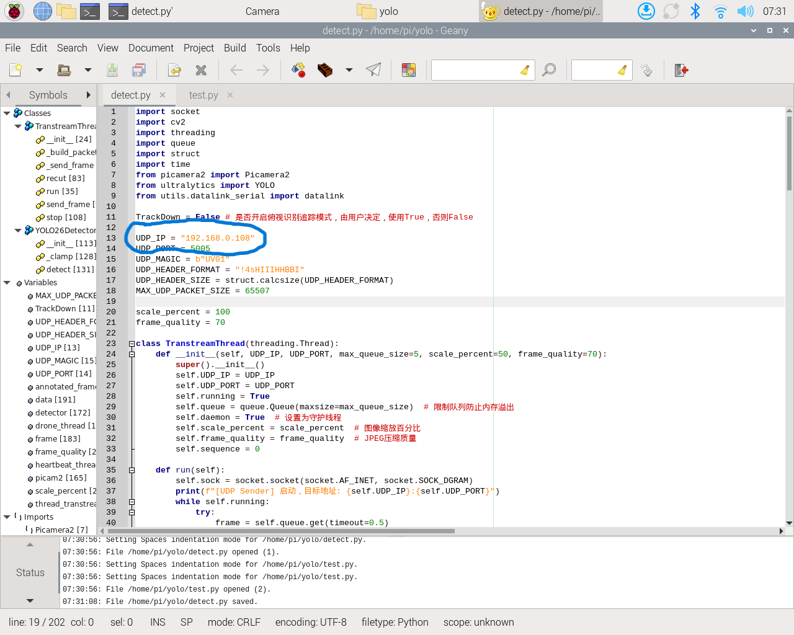
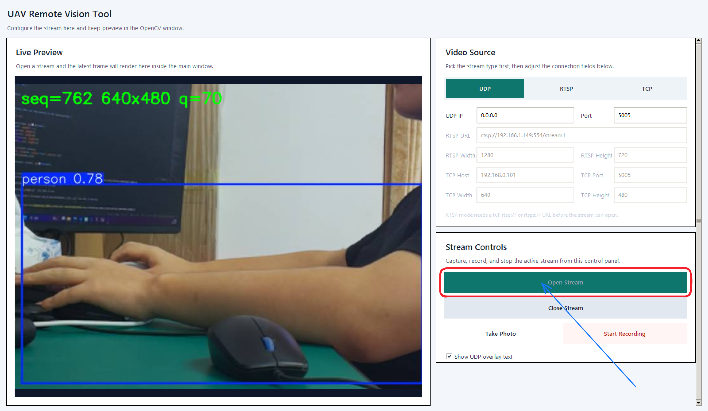

# 远程视频流接收

我们提供远程视频流接收脚本供用户使用

## 第 1 步：安装基础工具

脚本运行基础环境：windows系统，python-3.10，ffmpeg

- python下载：[请查看通用教程中的python安装](../../通用教程/基础环境安装.md)
- ffmpeg安装：[请查看通用教程中的ffmpeg安装](../../通用教程/基础环境安装.md)

装完后重新打开终端，检查：

```powershell
git --version
python --version
ffmpeg -version
```

## 第 2 步：获取项目

```text
网盘地址：https://pan.baidu.com/s/1UCEvPT0VNRONLIOfqaq-_w
提取码：jber

uav_vision_pkg
  |- opencv-4.6.0.zip
  |- opencv_contrib-4.6.0.zip
  |- r8125-9.015.00.tar.bz2
  └─ librealsense.zip
  
uav_vision 机载电脑端的ros功能包

uav_remote 远程电脑端的python接收程序
```

下载该资料包，我们需要的是**uav_remote程序**

解压后进入项目目录即可。

## 第 3 步：创建虚拟环境并安装依赖

```powershell
python -m venv .venv
.\.venv\Scripts\activate
python -m pip install --upgrade pip
pip install -r uav_remote\requirements.txt
pip install numpy
```

## 第 4 步：启动地面端程序

单路：

```powershell
python uav_remote\main_single.py
```

双路：

```powershell
python uav_remote\main_couple.py
```

四路：

```powershell
python uav_remote\main_four.py
```

## 运行detect.py程序，同时启动单路视频流接收

保证我们的远程电脑和树莓派处于统一局域网下

在启动detect.py之前，我们首先要更改detect.py的UDP包发送地址为我们远程电脑的地址，如下图(此时我的电脑ip地址是192.168.0.108,端口默认5005)




### 启动`detect.py`

~~~
cd ~/yolo
source ./.venv/bin/activate
python detect.py
~~~

此时我们可以在树莓派上看到CSI摄像头的界面

### 启动地面端程序

```powershell
python uav_remote\main_single.py
```

