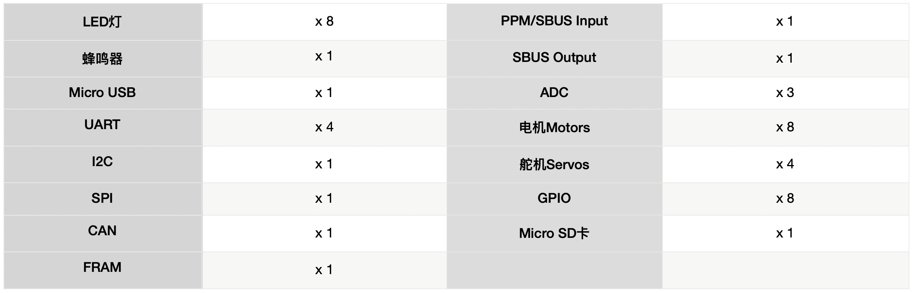
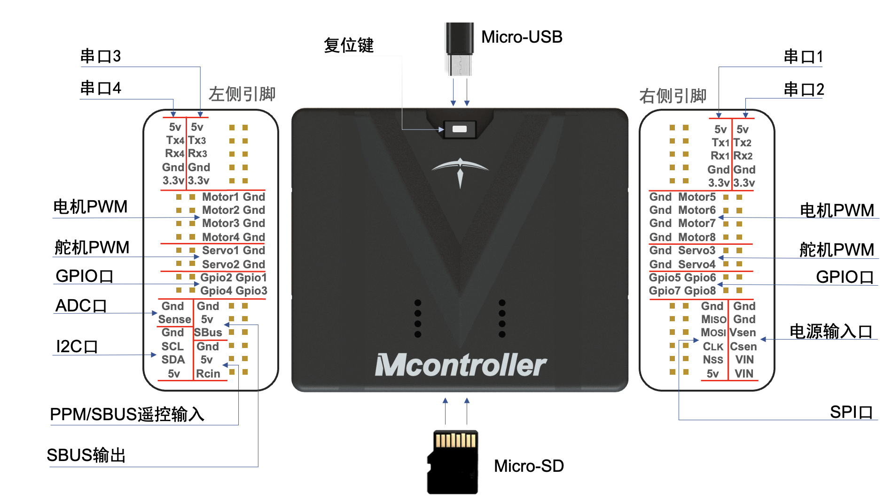

---
sidebar_position: 1
---

# 用前须知
‘
## Mcontroller-v7 控制器

Mcontroller® 是一款先进的飞控系统，由北航技术团队历时五年研发，拥有多项发明专利，被广泛应用于无人机、无人车、无人船等机器人领域。其强大的性能和独创的跨模态系统架构使其成为业界新秀。 Mcontroller® 具备卓越的稳定性、可扩展性和灵活性，为用户提供高效、便捷的移动机器人控制解决方案，助力教育科研和机器人产品研发。

板载资源有:

物理接口有:

## 静态调试

使用我们配备的USB烧录线，一头连接飞控Micro-USB口，另一头连接电脑USB口。

:::tip

静态调试状态下与无人机电池无关，可以一边给电池充电一边静态调试，节省时间。

:::