# App 用户手册

## 一、使用指南

FanciSwarm App 下载网址：[https://www.fancinnov.com/downloads](https://www.fancinnov.com/downloads)

### 查看版本

FanciSwarm App与FanciSwarm® 无人机成功连接后，点击右下角图标，可以查看Mcontroller固件版本号和App版本号，如下图所示：

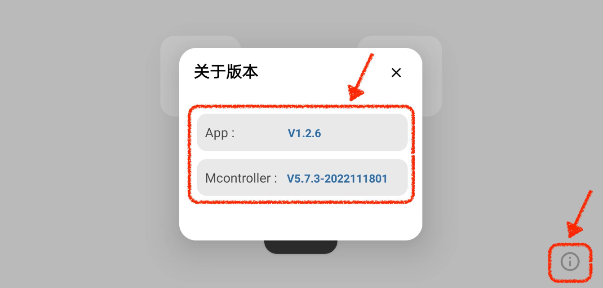

### 数据监测

FanciSwarm App可实时监测FanciSwarm® 无人机相关的多项数据，如下图所示：

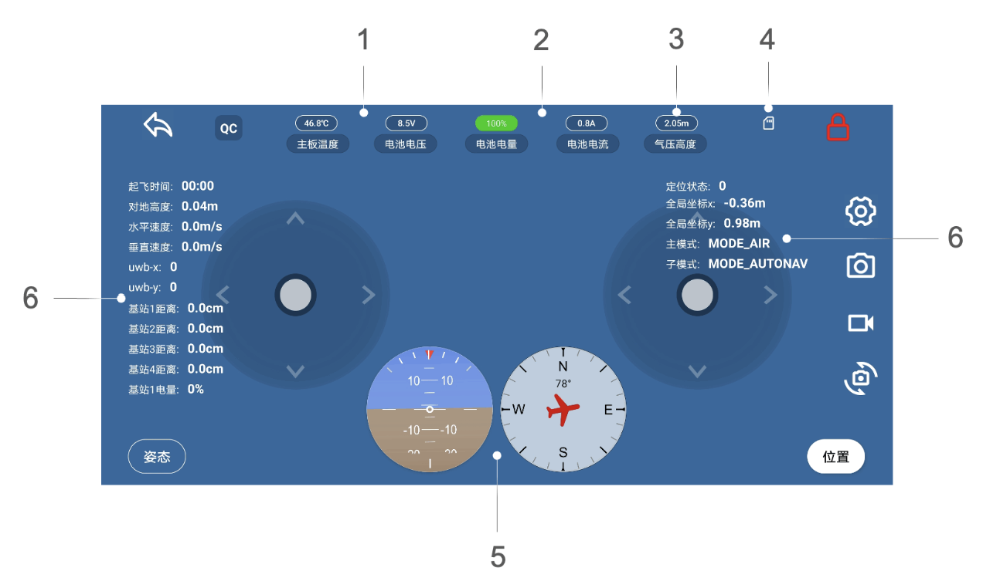

#### 1、主板温度与电池电压

界面上方实时显示主板温度和电池电压的数值。

#### 2、电池电量和电池电流

界面上方实时显示电池电量和电池电流的数值。

#### 3、气压高度

界面上方实时显示气压高度的数值。

#### 4、板载SD卡的数据写入提示

当数据正在写入时，SD卡标识为绿色，否则为白色。

#### 5、姿态球

姿态球左图可实时反映控制器俯仰角和横滚角的变化。当俯仰角变化时，天地线和梯度线会上下移动；当横滚角变化时，天地线和梯度线会左右倾斜。

姿态球右图可实时反映控制器偏航角的变化。当偏航角变化时，红色飞机标识会旋转，上方的角度数值会实时显示偏航角大小。

#### 6、其他数据

其他数据包含三部分。

（1）FanciSwarm® 无人机飞行数据。起飞时间、对地高度、水平速度、垂直速度、主模式和子模式；

（2）uwb定位信息。定位状态、全局坐标x/y、uwb-x、uwb-y以及FanciSwarm® 在uwb定位系统内离四个基站的距离；

（3）基站信息。基站电量。

### 参数显示设置

主界面部分参数（上节中的第六点——其他数据）默认显示，“参数显示设置”功能可将其隐藏，并且App会记住并保存设置的状态。操作步骤分以下三步：

<strong>第一步，</strong>进入设置界面；

<strong>第二步，</strong>点击“参数显示设置按钮”，此时界面会出现如下图所示的设置界面；

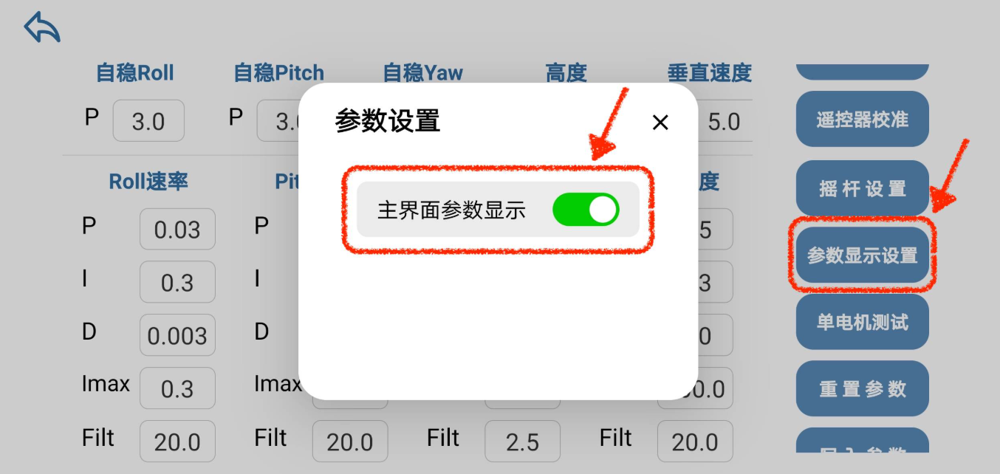

<strong>第三步，</strong>关闭“主界面参数显示按钮”即可隐藏主界面部分参数（上节中的第六点——其他数据），此时的主界面如下图所示。若重新设置为显示状态，开启“主界面参数显示按钮”即可。

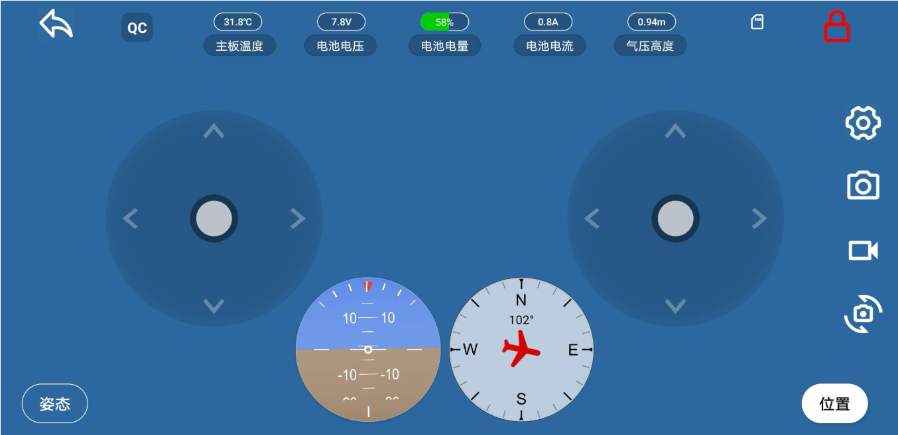

### 拍照录像

在FanciSwarm® 无人机搭配Mlink-video图传数传一体模块使用的情况下，FanciSwarm App主界面将出现稳定的视频流，并可以实时图传。点击下图所示的拍照按钮和录像按钮，得到的照片和视频会存储在手机本地相册以及Mlink-video板载microSD卡中；点击画面翻转按钮，画面会翻转180度。

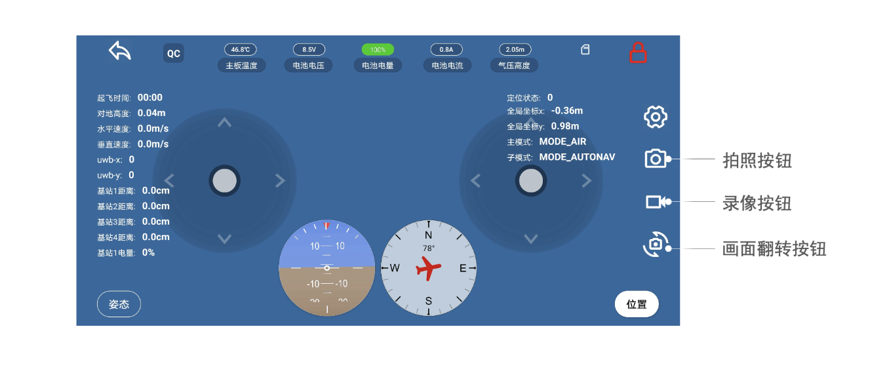

### 摇杆设置

点击摇杆设置按钮，此时界面会出现如下图所示的设置界面，可选择摇杆的启用和关闭、体感控制的启用和关闭。

（1）在体感控制关闭的情况下，用户可通过四通道摇杆操控 FanciSwarm® 无人机飞行，详细的摇杆操控说明请参见[快速入门指南——FanciSwarm® 飞行——使用App飞行](#使用-app-飞行)一节；

（2）在体感控制开启的情况下，用户可通过体感操控 FanciSwarm® 无人机飞行。

:::caution[特别说明]

（1）体感控制较灵活，方向感不易把握，不建议新手使用，因此，FanciSwarm App中默认关闭体感控制。

（2）在遥控器和FanciSwarm App同时连接的情况下，启用摇杆时，FanciSwarm® 无人机受App控制；关闭摇杆时，FanciSwarm® 无人机受遥控器控制。

:::

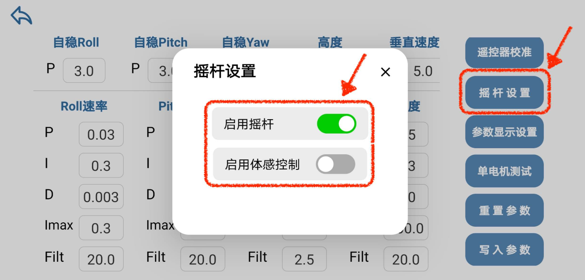

### 遥控器校准

由于每个遥控器的通道范围存在差异，为了记录相关通道的最大值和最小值就需要对遥控器进行校准。

:::caution[特别说明]

（1）配套的T8S遥控器出厂前已完成校准，除发生摇杆变形外（摇杆中位发生改变等），用户无需再次校准；

（2）FanciSwarm® 无人机适配市面上常用的遥控器，当用户选用其他遥控器时，需要对其进行校准；

（3）遥控器校准主要对前四个通道进行校准（Channel1～Channel4），其他通道无需校准。

:::

校准步骤分以下四步：

<strong>第一步，</strong>将遥控器和App同时连接FanciSwarm® 无人机；

<strong>第二步，</strong>进入设置界面，点击遥控器校准按钮，此时界面弹出遥控器校准界面；

<strong>第三步，</strong>上下左右拨动摇杆，使得Channel1～Channel4上的红色竖杠标识和绿色进度条随着Channel数值大小左右移动，直至进度条达到最小和最大值时，红色标识不再移动。Channel5～Channel8无需操作。如下图所示，图中的通道数值1000～2000对应着0～1，例如1500对应着0.5。

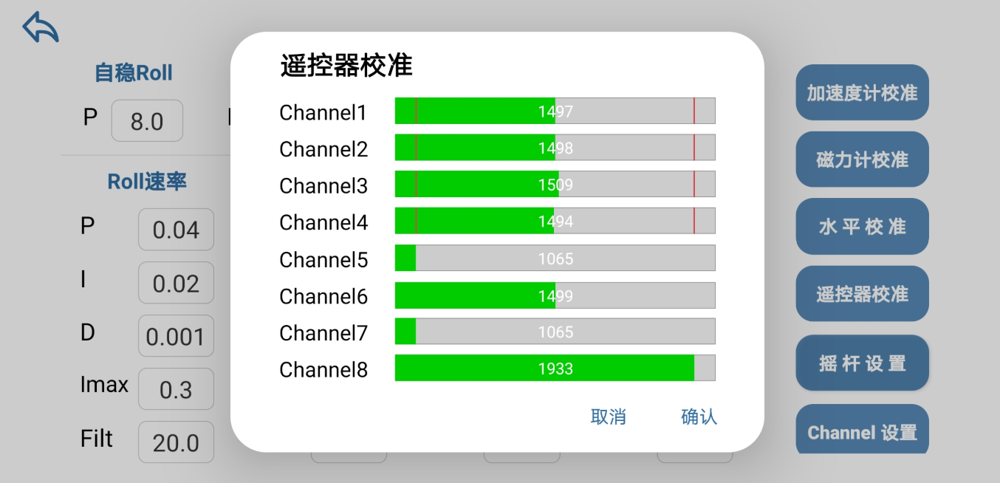

<strong>以乐迪AT9S遥控器的校准为例</strong>，[遥控器通道说明请点击查看](https://www.fancinnov.com/support-Mcontroller-v7#remote-control)。滚转为通道1（Channel1），俯仰为通道2（Channel2），油门为通道3（Channel3），偏航为通道4（Channel4）。滚转摇杆拉到最左对应Channel1绿条最短，拉到最右对应最长；俯仰摇杆拉到最上对应Channel2绿条最短，拉到最下对应最长；油门摇杆拉到最下对应Channel3绿条最短，拉到最上对应最长；偏航摇杆拉到最左对应Channel4绿条最短，拉到最右对应最长。

<strong>第四步，</strong>点击“确认”。当校准成功时，按钮文字将变为“校准成功”字样。

### 版本更新

确保用户已安装的FanciSwarm App版本号和幻思创新官网一致，若不一致，请下载安装最新版本。[点击查看FanciSwarm App最新版本](https://www.fancinnov.com/downloads#fanciswarm)。

## 二、App 飞行指南

### 使用 App 飞行

:::note[特别说明]
在遥控器和 FanciSwarm App 同时连接无人机的情况下，默认 App 具有最高优先级，即在“摇杆设置”中启用了摇杆，FanciSwarm® 无人机将受 App 控制；如果关闭 App 虚拟摇杆，则无人机将受遥控器控制。
:::

:::danger[特别注意]
使用 App 操控前请务必前往官网仔细阅读“FanciSwarm® 飞行前检查”一节<a href="https://www.fancinnov.com/support-FanciSwarm#fanciswarm-instructions" style={{textDecoration: 'none'}}>（点击查看）</a>。
:::

使用 App 飞行分为起飞、飞行中和降落环节，起飞和降落对于初次操作无人机的用户来说是难点，这里用快捷指令（一键起飞和一键降落）完成 FanciSwarm® 的起飞和降落。每个环节的操作步骤，如下所述。

### 1、一键起飞

一键起飞环节共分为 8 步。

**第一步，** FanciSwarm App 与 FanciSwarm® 成功连接后，点击“Start”按钮进入主界面；

**第二步，** 请确保主界面的摇杆样式为四通道摇杆，选中的飞行模式为位置模式，并与下图保持一致：

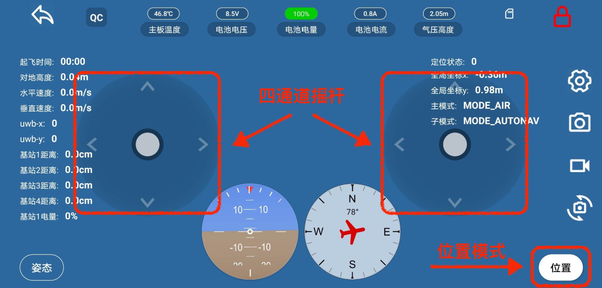

**第三步，** 认识主界面上的部分图标，方便后续操控，如下图所示：

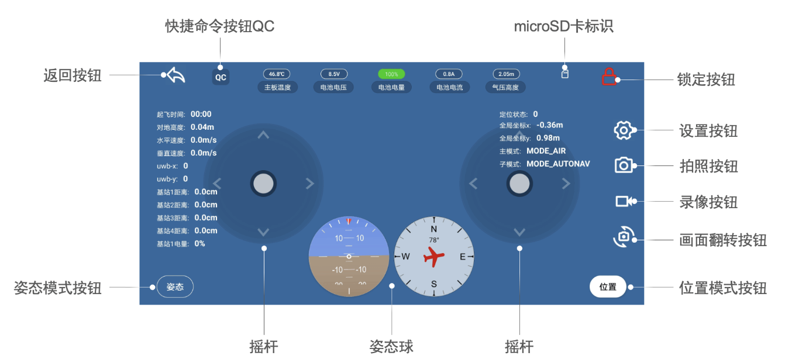

**第四步，硬件解锁前检查。**

（1）请确认起落架（机架腿部）结构稳固、安装牢靠，无松动、无损坏。

（2）<strong style={{color: 'red'}}>对于没有搭载高精度 GNSS 模组<a href="https://www.fancinnov.com/Fancinnov-FGNSS" style={{color: 'red', textDecoration: 'none'}}>（点击查看模组介绍）</a>的机型。</strong>

:::note[特别说明]
该机型适合在室内飞行，起飞前务必确保<strong style={{color: 'red'}}>地面纹理清晰</strong>。特别注意！在 FanciSwarm® 无人机启动提示音结束后，将无人机沿垂直于地面的方向拿起一次，<strong style={{color: 'red'}}>拿到距离地面超过 1 m 后再放回地面</strong>。只有激光测距功能正常，第五步的解锁才能顺利进行；否则 FanciSwarm 会发出“滴滴滴...”的报警音，同时固件会强制锁定，不允许起飞。
:::

（3）<strong style={{color: 'red'}}>对于搭载高精度 GNSS 模组<a href="https://www.fancinnov.com/Fancinnov-FGNSS" style={{color: 'red', textDecoration: 'none'}}>（点击查看模组介绍）</a>的机型。</strong>

:::note[特别说明]
该机型既可以在室内飞行，也可以在室外飞行。
:::

**室内飞行：** 无需安装 GNSS 柱状天线，无需关注“GNSS 定位状态”，起飞前务必确保 <strong style={{color: 'red'}}>地面纹理清晰</strong>，硬件解锁前的检查操作与上述第（2）项保持一致。

**室外飞行：** 务必安装 GNSS 柱状天线，务必关注“GNSS 定位状态”，无需关注地面纹理。请特别注意！首次开机使用时，务必将无人机静置在地面，并耐心等待。当 App 主界面上显示的 <strong style={{color: 'red'}}>“GNSS 定位状态”为 2 时</strong>，表示当前环境 GNSS 信号良好，您可以进行解锁操作（见第五步）并顺利起飞；如果“GNSS 定位状态”在 1 和 2 之间跳变，说明当前 GNSS 信号不稳定（如受到高大建筑物遮挡），建议将无人机转移至信号良好的区域进行飞行；当“GNSS 定位状态”不为 2 时，若强行解锁，FanciSwarm 会发出“滴滴滴…”的报警声，且固件会强制锁定，不允许起飞。

**第五步，硬件解锁。**

点击主界面右上方的锁定按钮，按钮颜色将变为白色，Mcontroller 右侧 LED 绿灯将点亮，并伴随着启动声音。

（注：若想撤消该步操作，请长按锁定按钮，按钮颜色将由白色变为红色。）

**第六步，** 点击快捷命令按钮 QC（QC: Quick Command 的简称），将弹出快捷命令窗口；

**第七步，长按发送。**

长按一键起飞按钮 1.5 s，圆形进度条会随着长按逐渐闭合，当进度条完全闭合，即可将指令发送出去。第五、六、七步的操作如下图所示：

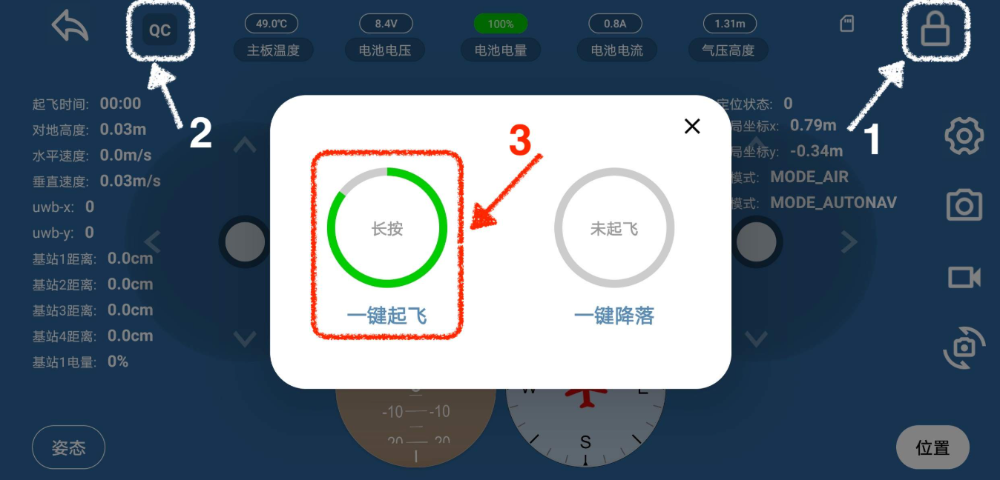

**第八步，完成起飞。**

当发送成功时，手机会伴随着振动和声音提示，界面会出现指令发送成功的弹窗，并且快捷命令窗口会自动关闭。FanciSwarm® 无人机将缓慢上升，此时锁定按钮变为绿色，microSD 卡标识变为绿色（若没有安装 microSD 卡则为白色），飞行日志开始记录。

当你做到这一步时，恭喜你完成了 FanciSwarm® 的首次起飞。接下来，按照下述“飞行中”的说明操作，去飞吧！

### 2、飞行中

飞行中环节是指操控无人机上、下、前、后、左、右运动以及转向。

:::danger[特别注意]

（1）为防止误触，用户需要长按摇杆，感受到振动反馈后方可拖动摇杆；

（2）每次拖动摇杆后，需要及时松手，松手后摇杆会自动回中。若不回中，无人机会持续向摇杆控制的方向运动；

（3）锁定按钮颜色为绿色的情况下，切勿进行长按，长按会使 FanciSwarm® 无人机的电机在空中停转，很有可能造成坠毁；

（4）飞行中务必确保 FanciSwarm® 无人机在用户视野范围之内；

（5）请仔细阅读上述四点及下述的操作说明，缓慢拖动摇杆，小心操控，注意安全！

:::

:::note[特别说明]

（1）基于 FanciSwarm® 的安全保护机制，位置模式下，FanciSwarm® 最大飞行高度为 2 m；

（2）基于 FanciSwarm® 的安全保护机制，当 FanciSwarm® 无人机操作失控发生撞击时，会自动锁停电机。

:::

操控无人机上、下、前、后、左、右运动以及转向的详细说明，如下图所示：

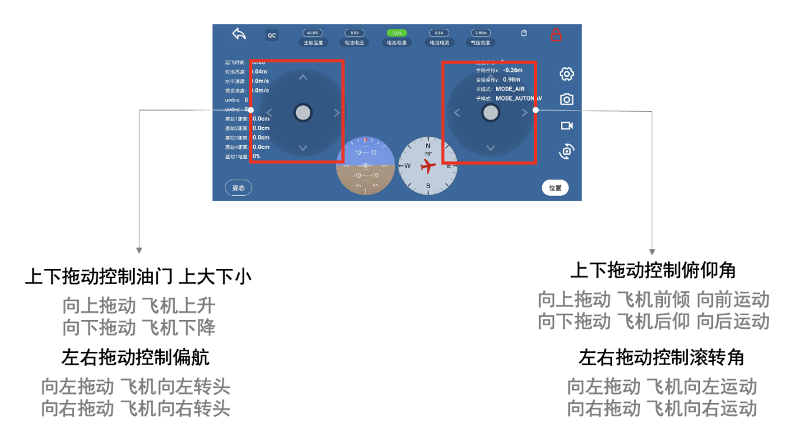

### 3、一键降落

:::note[特别说明]

（1）基于 FanciSwarm® 的安全保护机制，当 FanciSwarm® 无人机的电压下降到降落告警电压的数值时，会自动降落。降落告警电压默认为 6.4 V，用户可自定义；

（2）基于 FanciSwarm® 的安全保护机制，当 FanciSwarm® 无人机与 App 连接中断时，会自动降落。

:::

一键降落环节共分为四步。

**第一步，** 点击快捷命令按钮 QC，将弹出快捷命令窗口；

**第二步，长按发送。**

长按一键降落按钮 1.5 s，圆形进度条会随着长按逐渐闭合，当进度条完全闭合，即可将指令发送出去，如下图所示：

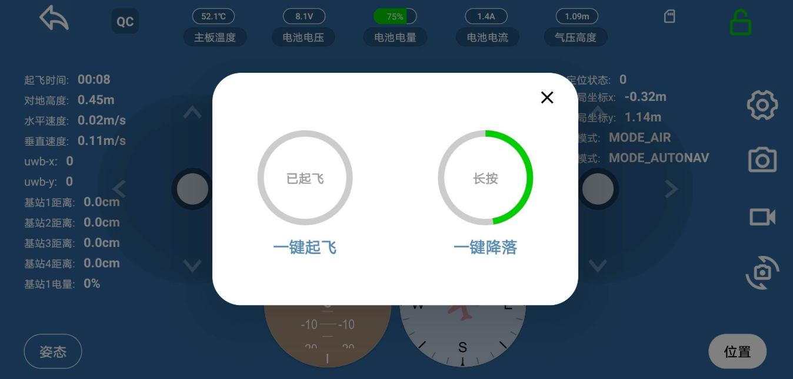

**第三步，完成降落。**

当发送成功时，手机会伴随着振动和声音提示，界面会出现指令发送成功的弹窗，并且快捷命令窗口会自动关闭，FanciSwarm® 将开始降落。着陆后，FanciSwarm® 电机停转，锁定按钮变为白色，microSD 卡标识变为白色，飞行日志结束记录并保存在内存卡中。

**第四步，锁定 FanciSwarm®，并关闭。**

操作口诀——“长按锁定”。长按锁定按钮 2 s，手机将伴随着轻微的振动，当 FanciSwarm® 电调指示灯熄灭，同时 Mcontroller 右侧 LED 绿灯熄灭、LED 红灯点亮，锁定按钮颜色将变为红色，此时 FanciSwarm® 锁定。锁定后，拨动开关到“0”位置，关闭 FanciSwarm®。特别说明：务必及时断开与电池的连接。

当你做到这一步时，恭喜你已经完成了用 App 操控无人机的全过程！接下来，参照“用户手册”，去探索 App 的更多功能吧！
