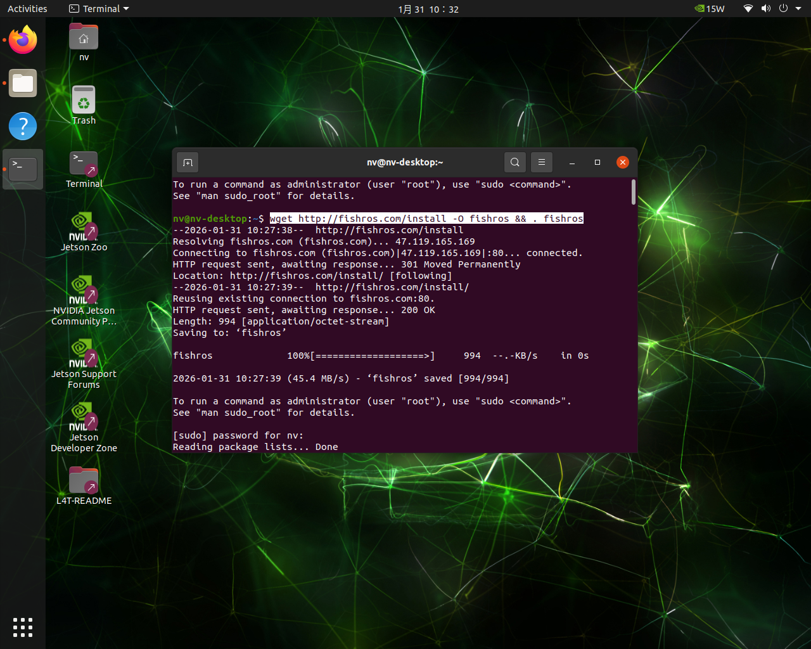
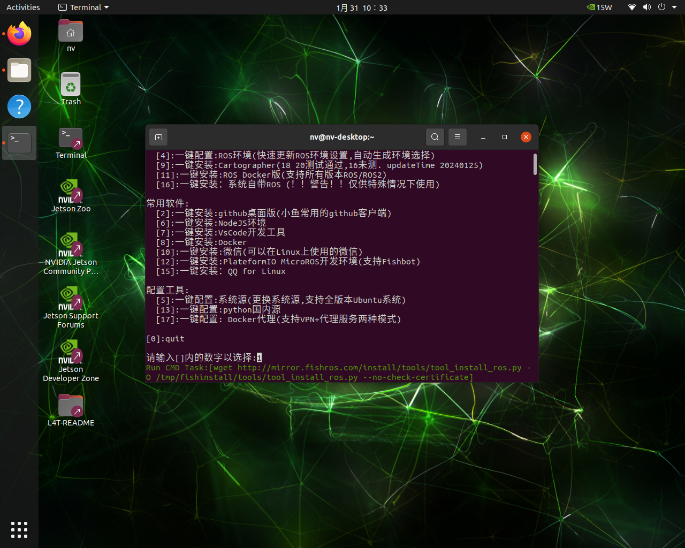
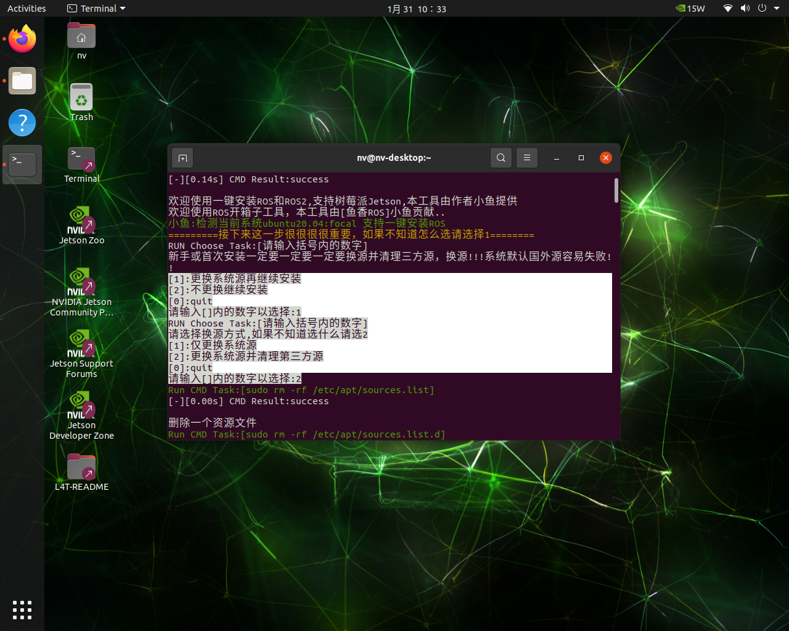
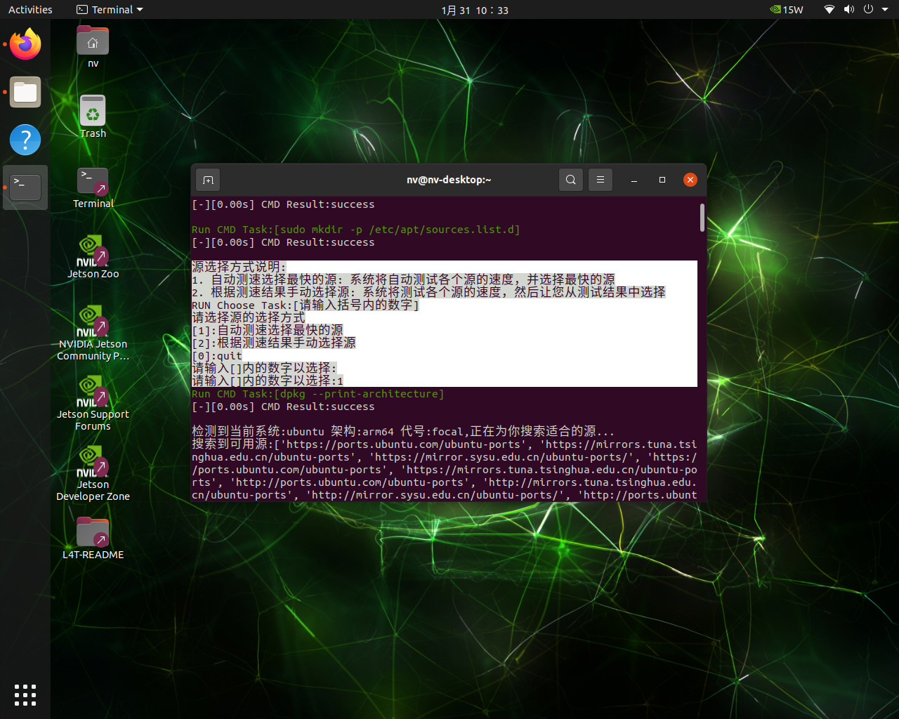
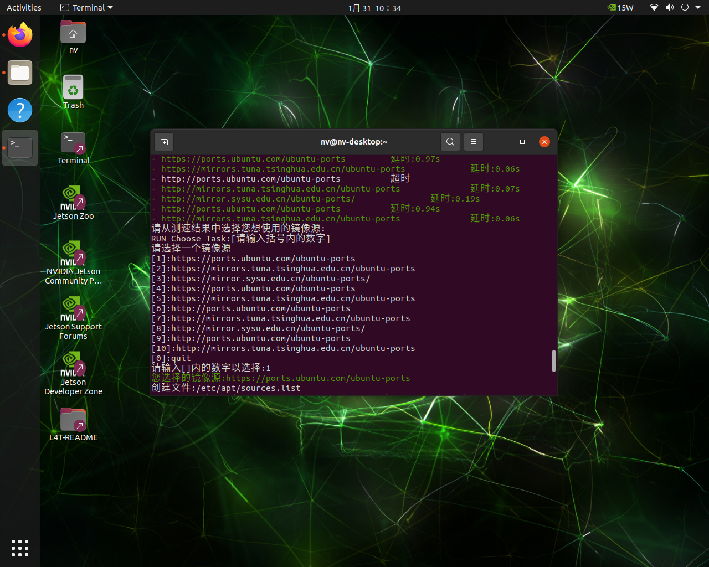
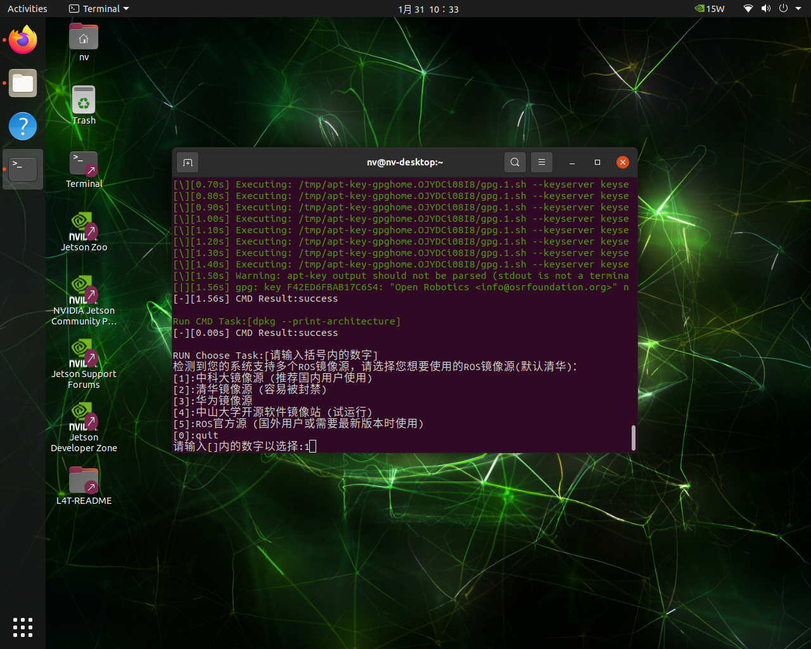
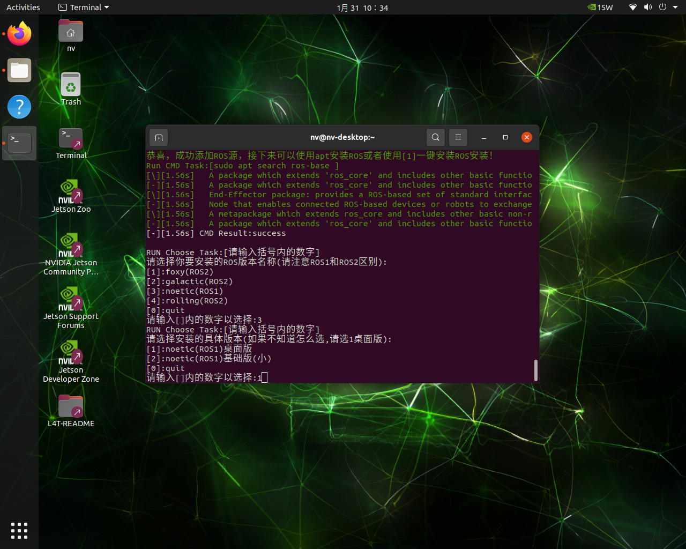
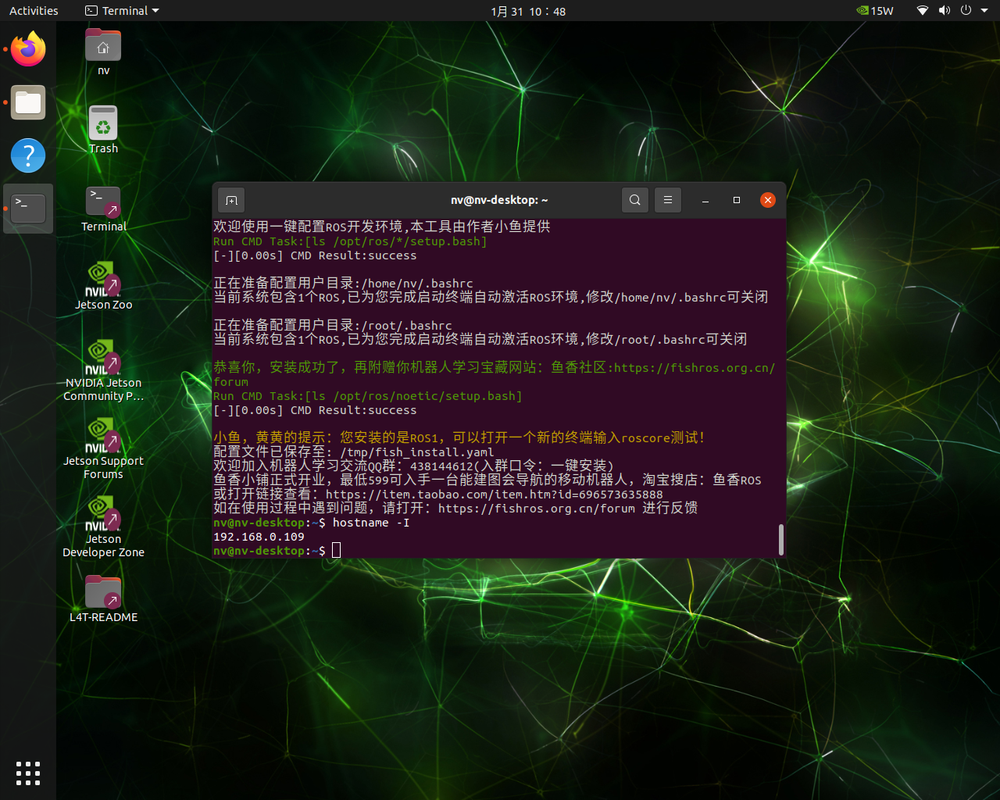

# 安装ROS

## 使用平台

- ubuntu 20.04(对机载电脑和虚拟机都适用)

## 开始安装

1. 复制下面指令至终端中并运行

~~~
wget http://fishros.com/install -O fishros && . fishros
~~~

执行结果如下所示

2. 选择1进行ROS安装

3. 更换apt源下载会更快

4. 可以使用自动测速选择apt

:::tip

一般情况下最快的apt源是清华源，但有时候清华源会访问失败，这是手动选择apt源，建议直接选择ubuntu官方apt源，虽然慢但是稳定

:::

5. 添加ROS源，这里直接选择中科大ROS源(经测试比较稳定)

6. 安装ROS，这里我们安装ROS-Noetic，如果您有需要可以尝试其他版本

7. 安装成功

