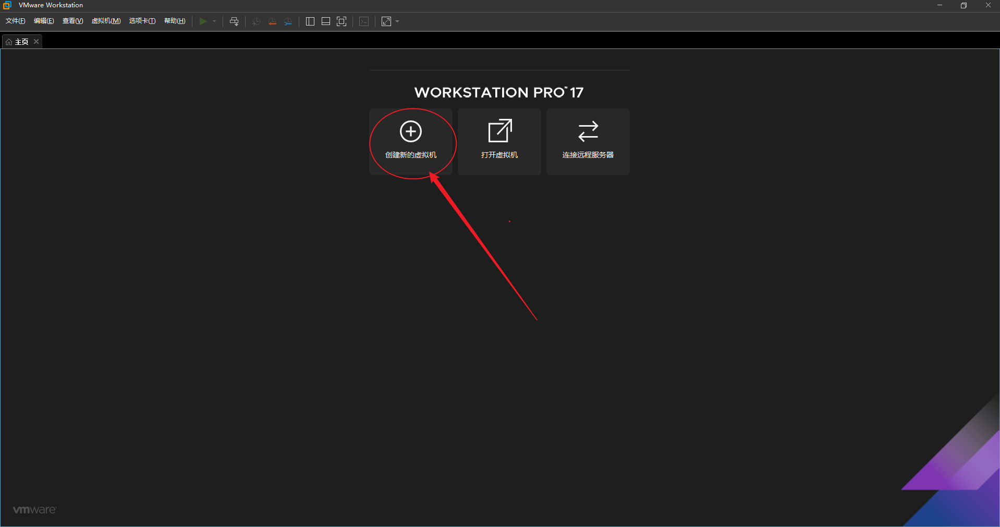
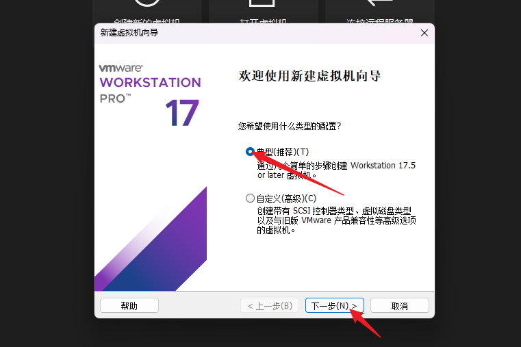
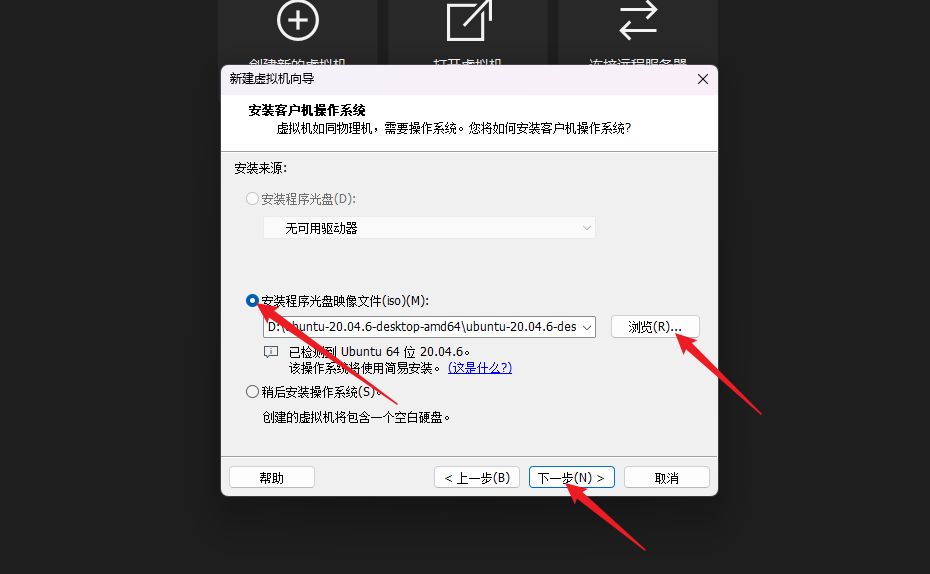
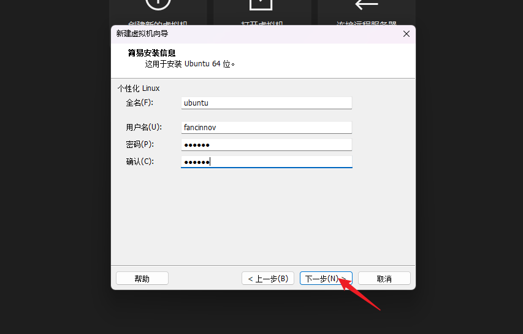
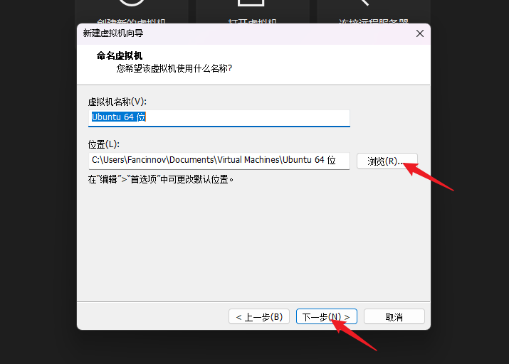
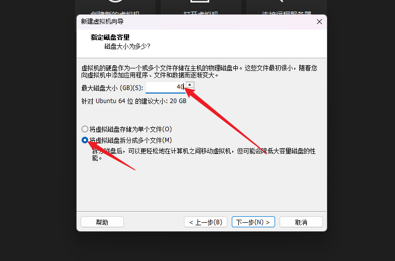
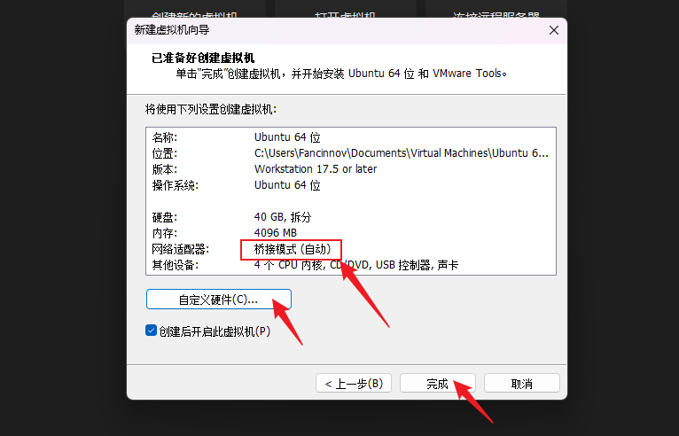
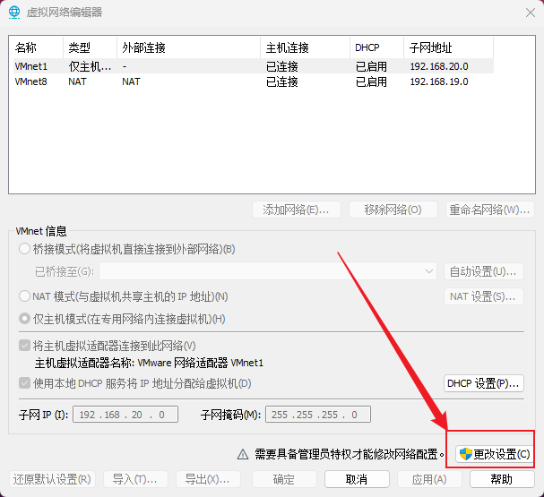
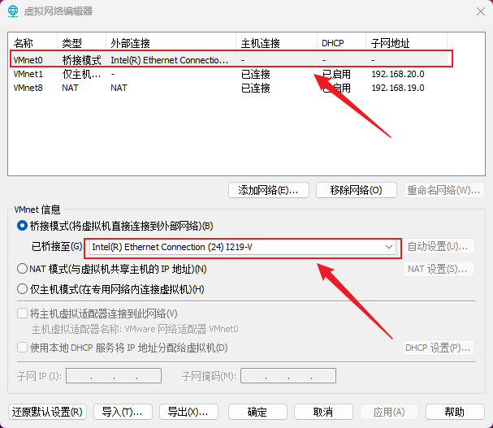

# VMware虚拟机使用手册

## 创建虚拟机

找到我们下载保存好的系统镜像

这一部分可以自定义

建议`40GB`，自行决定存放位置，**路径下不要有中文**

建议资源分配
- `4G`以上内存
- `40G`以上存储
- `2`个以上的cpu内核

**必须**
- 网络适配器: `桥接模式`

## 更换虚拟机默认连接网卡

虚拟机默认连接无线网卡，这时候如果用户想要连接有线网卡(以太网)，就需要一点设置更改

VMware虚拟机左上角的`编辑` -> `虚拟网络编辑器` -> `更改设置`

将`VMnet0`桥接至你的有线网卡上。

最后使用`ping`指令测试一下网络连通性

