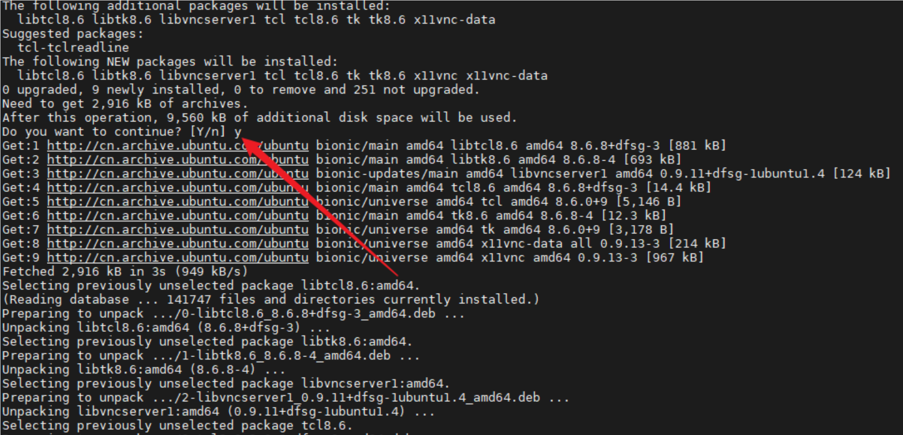
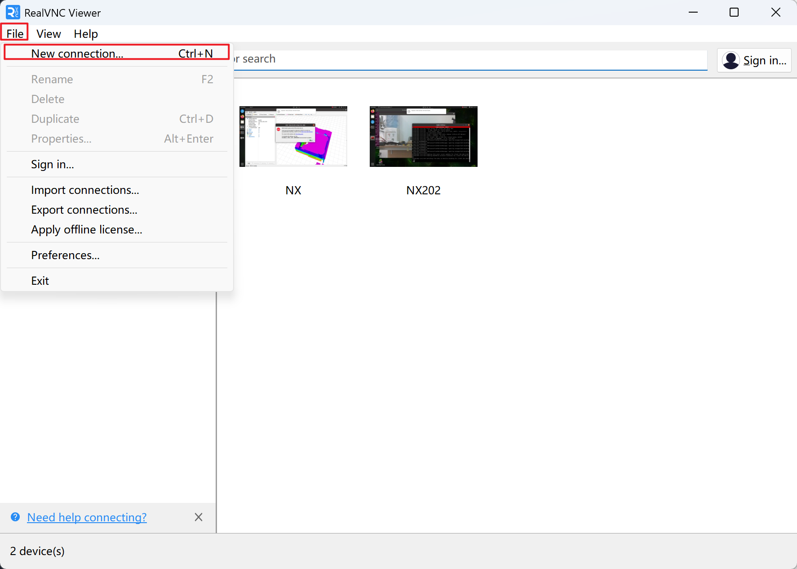
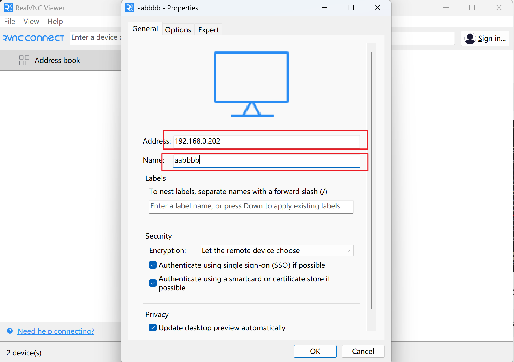
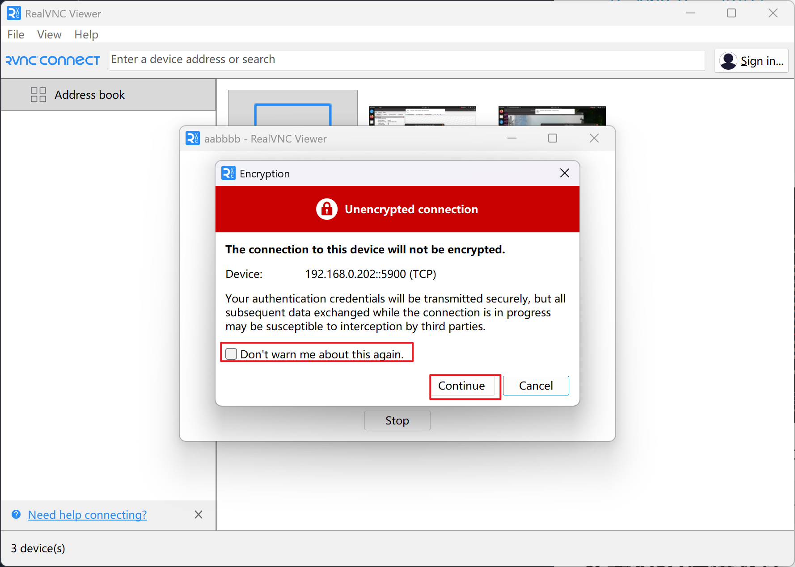
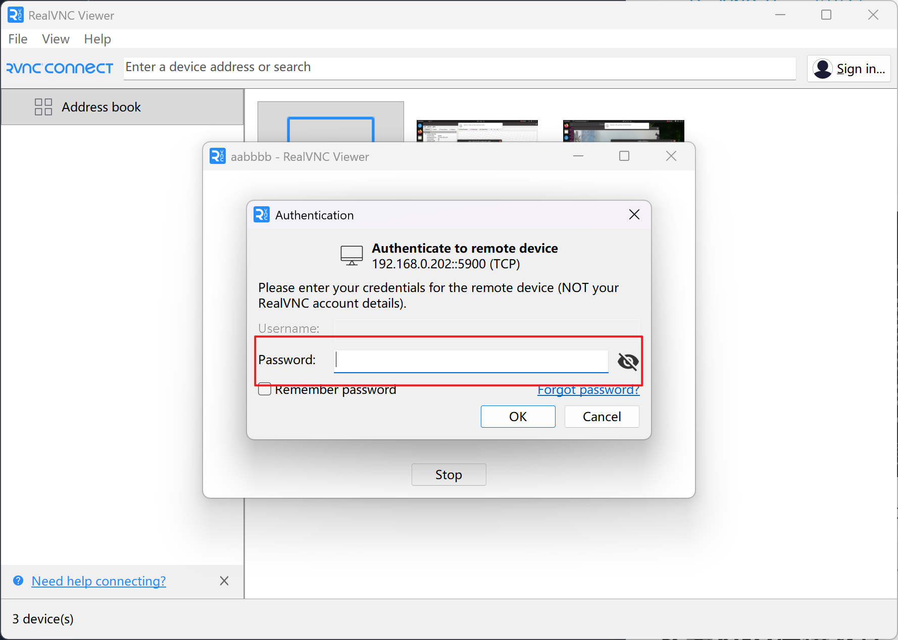
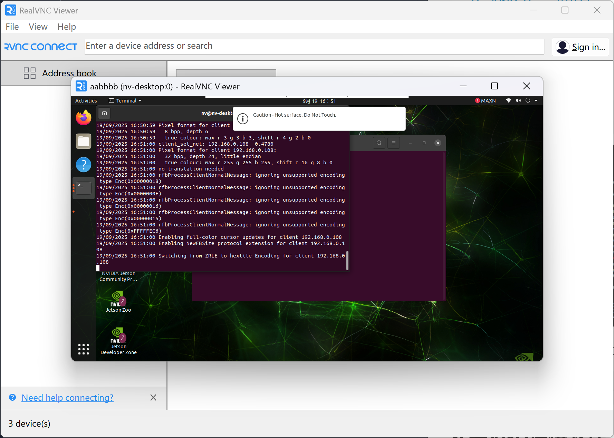

# VNC远程连接机载电脑

**需要欺骗器**

## 文件预览

- [RealVNC_Viewer安装包](https://akuma-mywebsite.oss-cn-chengdu.aliyuncs.com/tools/VNC-Viewer-7.15.0-Windows.exe)

## 安装x11VNC

连接好网络之后，运行下面指令，在JetsonNX上面安装X11vnc

~~~shell
sudo apt install x11vnc
~~~

安装好之后运行下面命令启动VNC服务

~~~shell
x11vnc -passwd 12345678 -display :0 -forever
~~~

## 安装VNC连接软件

我们在PC端的windows环境下安装RealVNC_Viewer

打开RealVNC_Viewer之后我们选择new connection

输入我们JetsonNX的IP地址并取个名称

继续

输入密码

然后就可以连接上了

如果想要开机自启动只需要把下面代码放到自启动脚本auto_ap.sh的最后就好了

~~~
{
	gnome-terminal --tab "vnc" -- bash -c "x11vnc -passwd 12345678 -display :0 -forever; exec bash"
}&
~~~