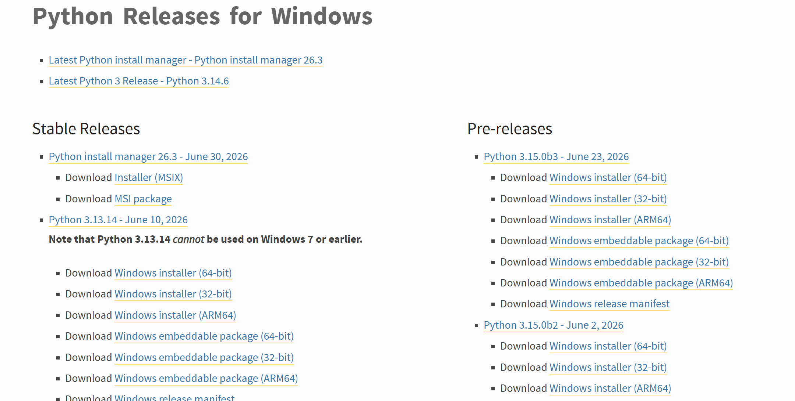
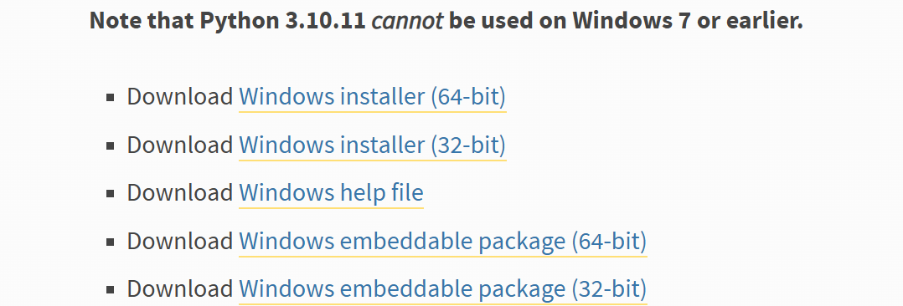
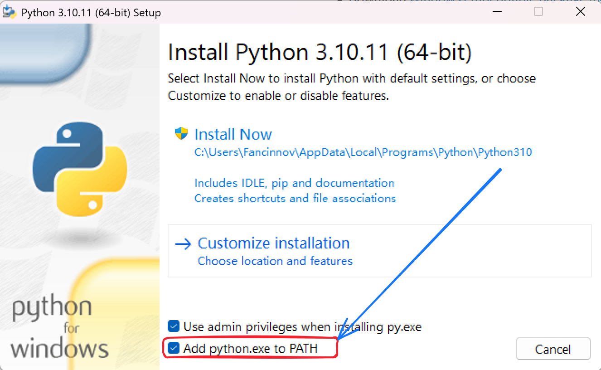
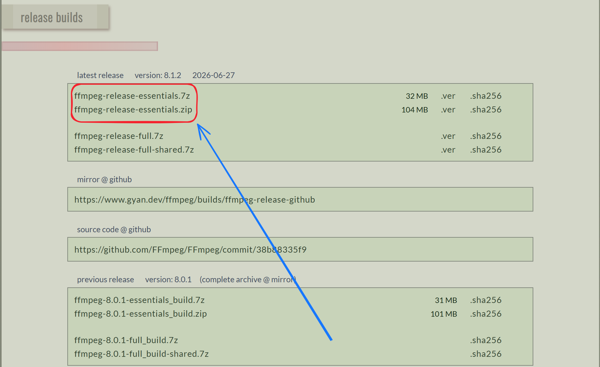
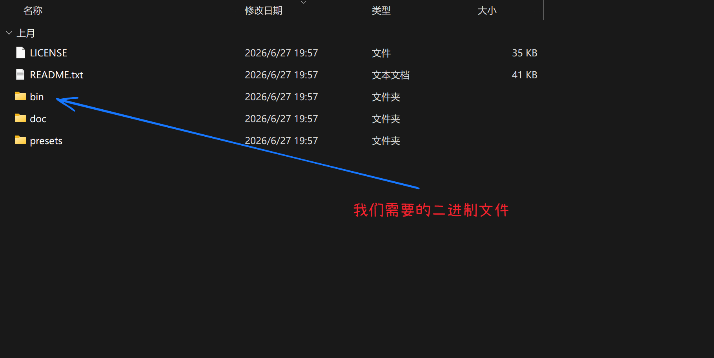
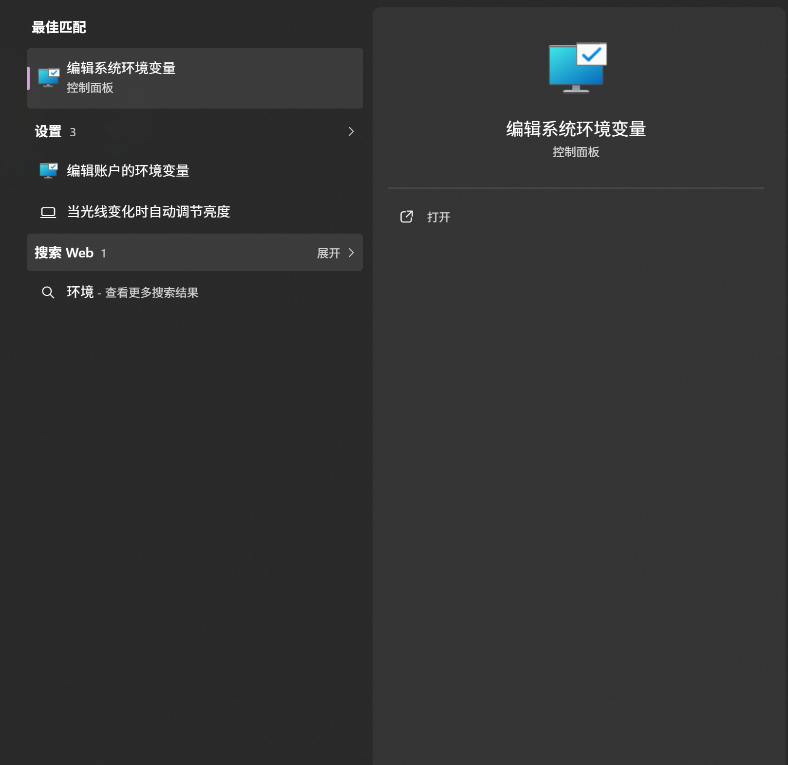
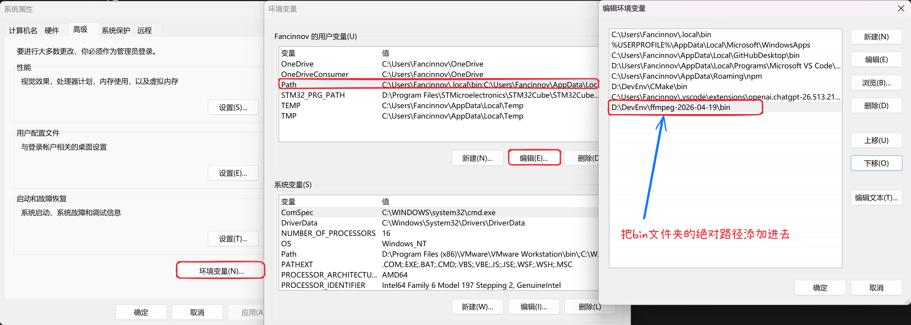

# 基础环境安装

因为一些脚本运行的需要，我们提供基础的环境安装教程，具体需要请根据目录到对应环境进行安装。

## python安装

:::tip

适用于windows用户

:::

1. 进入python官网:[https://www.python.org/downloads/windows/](https://www.python.org/downloads/windows/)

可以看到各个版本的下载链接，选择自己需要的python版本，这里以python3.10版本为例

2. 现代电脑都是64位的，所以一般情况下只需下载(64-bit)即可

3. 下载之后会给安装包，在勾选上`Add python.exe to PATH`之后点击`Install Now`即可

:::tip

如果没有勾选`Add python.exe to PATH`,使用python时就需要你自己手动指定路径。

:::

4. 验证环境安装，在powershell中输入下面命令，若返回版本信息和你下载的一致即安装成功。

~~~
python --version
~~~

## ffmpeg安装

1. 进入ffmpeg官网:[https://www.gyan.dev/ffmpeg/builds/](https://www.gyan.dev/ffmpeg/builds/)

下载编译好的压缩包

2. 解压之后存放到一个安全干净的文件夹内之后，进入该目录

记住这个bin文件的绝对路径

3. 打开系统环境变量编辑器

4. 添加bin文件夹的绝对路径

5. 验证安装环境，在powershell中输入下面命令，若返回版本信息和你下载的一致即安装成功。

~~~
ffmpeg -version
~~~